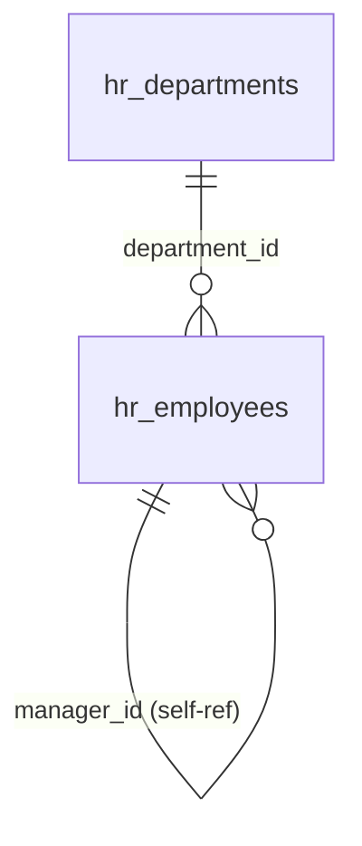

# Org Chart — Data Model

This module owns **no tables**. It reads data owned by [[../employee-profiles/_module|hr.profiles]]:

- `hr_employees` — uses the self-referential `manager_id` FK to build the hierarchy, plus name/title/photo for node display.
- `hr_departments` — used for the department filter and department-head display.

## Read Relationships (ERD)

The tree is assembled in memory from one query over `hr_employees` (cycle-safe; cycles are prevented at write time in hr.profiles).

## Related

- [[_module]]
- [[../employee-profiles/_module]]
- [[../../../security/tenancy-isolation]]
