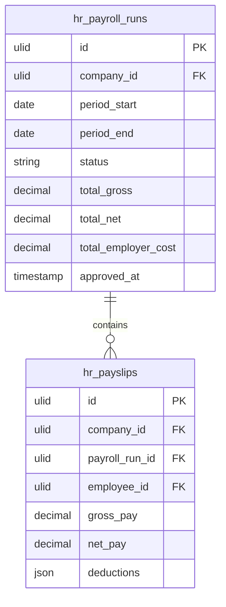

# Payroll

Payroll run management, payslip generation, deduction tracking, and employer cost reporting. FlowFlex does not process payments — it records and tracks payroll; actual payment goes through the company's bank or payroll provider.

---

## Core Features

- Payroll run: collect employees, apply salary, deductions, bonuses → generate payslips
- Payslip: breakdown of gross pay, deductions (tax, pension, insurance), net pay
- Deduction types: configurable per company (income tax rate, pension %, health insurance flat)
- Employer cost report: total gross payroll + employer contributions per run
- Payroll run status: `draft → processing → approved → archived`
- Payslip PDF generation and email delivery to employee
- Historical payslip archive accessible by employee via Self-Service
- Integration point with Finance: approved payroll run creates a journal entry stub in Finance

---

## Data Model

| Table | Key Columns |
|---|---|
| `hr_payroll_runs` | company_id, period_start, period_end, status, total_gross, total_net, total_employer_cost, approved_by, approved_at |
| `hr_payslips` | company_id, payroll_run_id, employee_id, gross_pay, net_pay, employer_cost, deductions (json) |
| `hr_deduction_types` | company_id, name, calculation_type (percent/flat), value, is_employer_contribution |

---

## Filament

**Nav group:** Payroll

- `PayrollRunResource` — list, create run (employee selection + salary data), approve, archive
- `PayslipResource` — read-only, per-employee, per-run view; download PDF
- `PayrollRunWidget` — summary stats (total headcount, gross, net, employer cost)

---

## Related

- [[domains/hr/employee-profiles]]
- [[domains/finance/general-ledger]] — journal entry integration on payroll approval
- [[domains/hr/compensation-benefits]]
