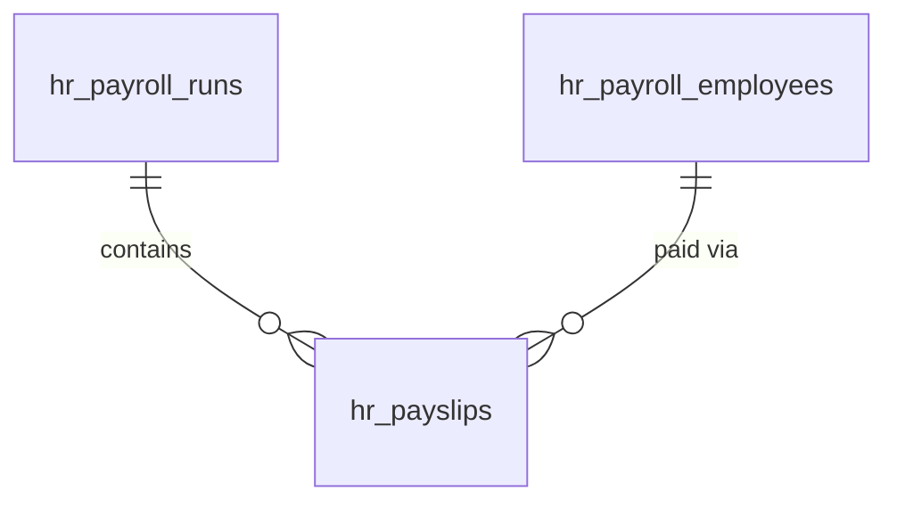

# Payroll

Payroll run management, payslip generation, deduction tracking, and employer cost reporting. FlowFlex does not process payments — it records and tracks payroll; actual payment goes through the company's bank or payroll provider.

---

## Dependencies

| Type | Module | Why |
|---|---|---|
| Hard | [[domains/hr/employee-profiles\|hr.profiles]] | payroll records per employee; EmployeeHired creates the stub |
| Hard | [[domains/core/billing-engine\|core.billing]] + [[domains/core/rbac\|core.rbac]] + [[domains/core/notifications\|core.notifications]] | gating, permissions, payslip mails |
| Soft | [[domains/finance/general-ledger\|finance.ledger]] | consumes `PayrollRunApproved` → GL journal entry; without it event fires unconsumed |
| Soft | [[domains/hr/leave-management\|hr.leave]] | unpaid-leave deductions via LeaveRequestApproved |
| Soft | [[domains/hr/time-attendance\|hr.time]] | hourly pay from TimesheetApproved |
| Soft | [[domains/finance/expenses\|finance.expenses]] | reimbursements via ExpenseApproved |
| Soft | [[domains/hr/compensation-benefits\|hr.compensation]] | benefit deductions feed payslips *(assumed)* |

---

## Core Features

- Payroll employee record (created by `EmployeeHired`, status `incomplete` until salary entered): salary, IBAN, tax parameters
- Payroll run: collect employees, apply salary, deductions, bonuses → generate payslips
- Payslip: breakdown of gross pay, deductions (tax, pension, insurance), net pay
- Deduction types: configurable per company (income tax rate, pension %, health insurance flat)
- Employer cost report: total gross payroll + employer contributions per run
- Payroll run status: `draft → processing → approved → archived`
- Payslip PDF generation and email delivery to employee
- Historical payslip archive accessible by employee via Self-Service
- Approved payroll run fires `PayrollRunApproved` → Finance posts the journal entry
- **All amounts integer cents via brick/money; salary + IBAN + payslip amounts encrypted ([[architecture/patterns/encryption]], `salary_band` derived column for reporting)**

---

## Data Model

### hr_payroll_employees *(new vs v1 spec — the per-employee payroll profile the EmployeeHired listener creates)*

| Column | Type | Constraints | Notes |
|---|---|---|---|
| id, company_id (indexed), employee_id FK unique | ulid | | |
| 🔐 salary_raw | text | nullable | encrypted integer cents (monthly gross) |
| salary_band | string | nullable | derived, coarse (reporting) |
| 🔐 iban | text | nullable | encrypted |
| pay_type | string | not null default `salaried` | salaried / hourly |
| 🔐 hourly_rate_raw | text | nullable | encrypted integer cents *(assumed)* |
| status | string | default `incomplete` | incomplete / ready |
| deleted_at | timestamp | nullable | |

### hr_payroll_runs

| Column | Type | Constraints | Notes |
|---|---|---|---|
| id, company_id (indexed) | ulid | | |
| period_start / period_end | date | not null | unique `(company_id, period_start)` |
| status | string | default `draft` | state machine |
| total_gross_cents / total_net_cents / total_employer_cost_cents | bigint | not null default 0 | |
| currency | string(3) | not null | |
| approved_by | ulid nullable FK users | | |
| approved_at | timestamp nullable | | |
| deleted_at | timestamp nullable | |

### hr_payslips

| Column | Type | Notes |
|---|---|---|
| id, company_id (indexed), payroll_run_id FK, employee_id FK | ulid | unique `(payroll_run_id, employee_id)` |
| 🔐 amounts_raw | text | encrypted json: gross_cents, net_cents, employer_cost_cents, deductions[] |
| pdf_path | string nullable | tenant-scoped |
| deleted_at | timestamp nullable | kept 7 years per [[architecture/data-lifecycle]] |

### hr_deduction_types

| Column | Type | Notes |
|---|---|---|
| id, company_id (indexed) | ulid | |
| name | string | |
| calculation_type | string | percent / flat |
| value | int | basis points for percent *(assumed)* / cents for flat |
| is_employer_contribution | boolean | |
| deleted_at | timestamp nullable | |



---

## State Machine

Column: `hr_payroll_runs.status` — `PayrollRunState`.

| State | Transitions to | Triggered by (permission) | Side effects |
|---|---|---|---|
| `draft` | `processing` | `hr.payroll.process` | payslip generation job dispatched |
| `processing` | `draft` | job failure | error surfaced, payslips rolled back |
| `processing` | `approved` | `hr.payroll.approve` (after payslips generated) | fires `PayrollRunApproved`; payslip mails queued |
| `approved` | `archived` | `hr.payroll.archive` | read-only |

Approver ≠ run creator *(assumed: four-eyes on payroll)*. Transitions audited.

---

## DTOs

### CreatePayrollRunData (input)
| Field | Type | Validation |
|---|---|---|
| period_start / period_end | CarbonImmutable | required; end after start; unique period per company |
| employee_ids | array<string> | required min:1, each `ready` payroll status |

Message: "A payroll run for this period already exists."

### UpdatePayrollEmployeeData (input)
| Field | Type | Validation |
|---|---|---|
| employee_id | string | required ulid |
| salary_cents | ?int | min:0 |
| iban | ?string | iban format *(propaganistas not applicable — custom rule)* |
| pay_type | string | in:salaried,hourly |

### PayslipData (output)
id, employee_id, employee_name, period, gross_cents, net_cents, employer_cost_cents, deductions[] (name, amount_cents), currency — decrypted only for authorized viewers

## Services & Actions

Interface→Service: `PayrollServiceInterface` → `PayrollService`.

- `createRun(CreatePayrollRunData $data): PayrollRunData`
- `processRun(string $runId): void` — dispatches `GeneratePayslipsJob`; throws `IncompletePayrollProfileException` listing blockers
- `approveRun(string $runId): PayrollRunData` — throws `CannotApproveOwnRunException`, `InvalidStateTransitionException`; fires `PayrollRunApproved`
- `payslipsFor(string $employeeId): Collection<PayslipData>` — self-service path enforces own-scope
- Money math exclusively brick/money

## Events

### Fires: PayrollRunApproved
| Payload field | Type |
|---|---|
| company_id | string |
| payroll_run_id | string |
| period_start / period_end | CarbonImmutable |
| total_gross_cents / total_net_cents | int |
| currency | string |

### Consumes (listeners, all queued + WithCompanyContext, behavior per [[architecture/event-bus]]):
- `EmployeeHired` → `CreatePayrollRecordListener` (stub, status incomplete)
- `EmployeeOffboarded` → `FinalPayListener` (flag final run incl. leave payout)
- `LeaveRequestApproved` → `UpdatePayrollDeductionsListener` (unpaid types only)
- `TimesheetApproved` → hours feed hourly pay
- `ExpenseApproved` → reimbursement line next run (employee_id non-null only)

---

## Filament

**Nav group:** Payroll

| Artifact | Kind ([[architecture/ui-strategy]] row) | Notes |
|---|---|---|
| `PayrollRunResource` | #1 CRUD resource | create run, process/approve/archive actions; view = payslip table |
| `PayslipResource` | #1 (read-only) | per-employee per-run; PDF download |
| `PayrollEmployeeResource` | #1 CRUD | salary/IBAN entry (view-sensitive gated) |
| `DeductionTypeResource` | #1 CRUD | company deduction config |
| `PayrollRunWidget` | #6 widget | headcount, gross, net, employer cost of latest run |

---

## Permissions

`hr.payroll.view-any` · `hr.payroll.view` · `hr.payroll.create` · `hr.payroll.process` · `hr.payroll.approve` · `hr.payroll.archive` · `hr.payroll.manage-deductions` · `hr.payroll.view-sensitive`

---

## Jobs & Scheduling

| Job / Command | Queue | Schedule | Idempotency |
|---|---|---|---|
| `GeneratePayslipsJob` | hr | on process | upsert per `(run, employee)` unique — re-run safe |
| `GeneratePayslipPdfJob` | exports | per payslip | overwrites pdf_path |
| `PayslipMail` | notifications | on approve | skips `email_deliverable=false` |

---

## Test Checklist

- [ ] Tenant isolation + module gating
- [ ] EmployeeHired creates incomplete payroll record
- [ ] Run with incomplete profiles blocked with named blockers
- [ ] Deduction math (percent + flat) exact via brick/money — no float drift
- [ ] Approve fires `PayrollRunApproved` with contract payload
- [ ] Approver cannot approve own run
- [ ] Unpaid leave deduction lands on next run; paid leave no-op
- [ ] Salary/IBAN/payslip amounts ciphertext in DB; `view-sensitive` gates display
- [ ] Self-service payslip access = own only
- [ ] Duplicate period run rejected

---

## Build Manifest

```
database/migrations/xxxx_create_hr_payroll_employees_table.php
database/migrations/xxxx_create_hr_payroll_runs_table.php
database/migrations/xxxx_create_hr_payslips_table.php
database/migrations/xxxx_create_hr_deduction_types_table.php
app/Models/HR/{PayrollEmployee,PayrollRun,Payslip,DeductionType}.php
app/States/HR/PayrollRun/{PayrollRunState,Draft,Processing,Approved,Archived}.php
app/Data/HR/{CreatePayrollRunData,UpdatePayrollEmployeeData,PayrollRunData,PayslipData}.php
app/Contracts/HR/PayrollServiceInterface.php
app/Services/HR/PayrollService.php
app/Exceptions/HR/{IncompletePayrollProfileException,CannotApproveOwnRunException}.php
app/Events/HR/PayrollRunApproved.php
app/Listeners/HR/{CreatePayrollRecordListener,FinalPayListener,UpdatePayrollDeductionsListener,ApplyTimesheetHoursListener,AddReimbursementListener}.php
app/Jobs/HR/{GeneratePayslipsJob,GeneratePayslipPdfJob}.php
app/Mail/HR/PayslipMail.php
app/Filament/HR/Resources/{PayrollRunResource,PayslipResource,PayrollEmployeeResource,DeductionTypeResource}.php
app/Filament/HR/Widgets/PayrollRunWidget.php
database/factories/HR/{PayrollEmployeeFactory,PayrollRunFactory,PayslipFactory,DeductionTypeFactory}.php
tests/Feature/HR/{PayrollRunTest,PayslipCalculationTest,PayrollListenersTest,PayrollEncryptionTest}.php
```

---

## Open Questions

- Tax calculation depth: v1 = configurable flat/percent deduction types only, NO statutory tax engine *(assumed)* — real NL/DE tax tables are a Phase 2+ integration decision (ADR when needed)

---

## Related

- [[domains/hr/employee-profiles]]
- [[domains/finance/general-ledger]] — journal entry on approval
- [[domains/hr/compensation-benefits]]
- [[architecture/event-bus]]
- [[architecture/patterns/encryption]]
