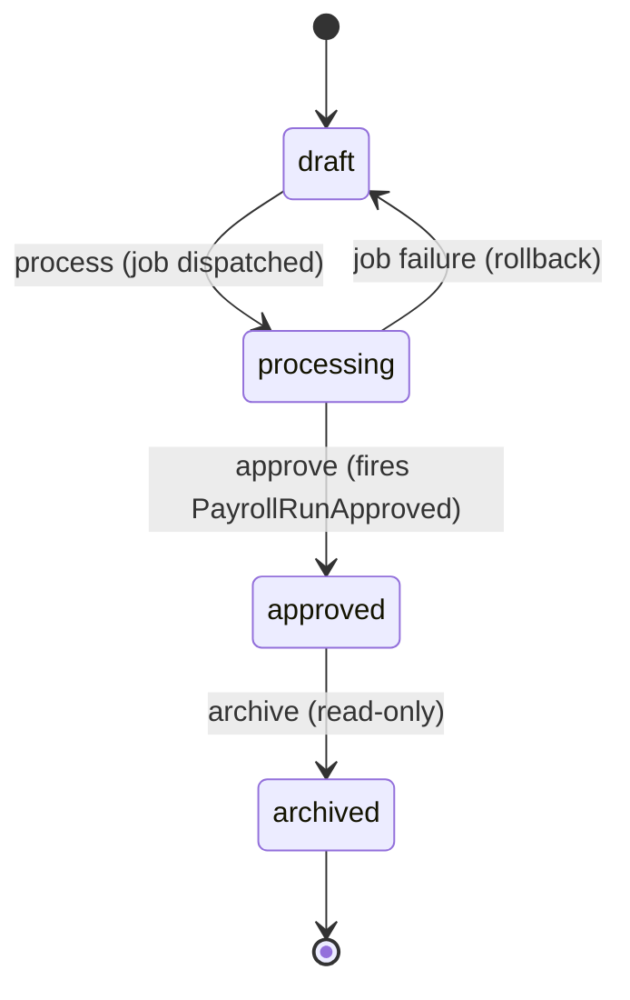
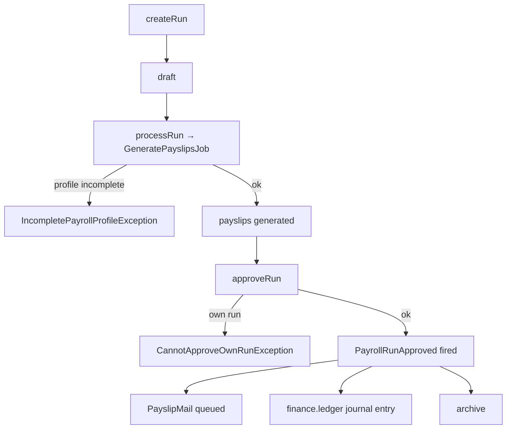

# Payroll — Architecture

Services, actions, and the payroll run state machine. See [[_module]].

---

## Services & Actions

Interface→Service per [[../../../architecture/patterns/interface-service]]: `PayrollServiceInterface` → `PayrollService`.

| Method | Behavior |
|---|---|
| `createRun(CreatePayrollRunData $data): PayrollRunData` | creates a `draft` run; rejects duplicate period per company |
| `processRun(string $runId): void` | dispatches `GeneratePayslipsJob`; throws `IncompletePayrollProfileException` listing blockers |
| `approveRun(string $runId): PayrollRunData` | throws `CannotApproveOwnRunException`, `InvalidStateTransitionException`; fires `PayrollRunApproved` |
| `payslipsFor(string $employeeId): Collection<PayslipData>` | self-service path enforces own-scope |

Money math is **exclusively** `brick/money` (integer minor units) — see [[../../../architecture/packages]] and [[security]].

---

## State Machine

Column `hr_payroll_runs.status` → `PayrollRunState` (spatie/model-states, [[../../../architecture/patterns/states]]).

| State | Transitions to | Triggered by (permission) | Side effects |
|---|---|---|---|
| `draft` | `processing` | `hr.payroll.process` | payslip generation job dispatched |
| `processing` | `draft` | job failure | error surfaced, payslips rolled back |
| `processing` | `approved` | `hr.payroll.approve` (after payslips generated) | fires `PayrollRunApproved`; payslip mails queued |
| `approved` | `archived` | `hr.payroll.archive` | read-only |

Approver ≠ run creator *(assumed: four-eyes on payroll — see [[unknowns]])*. Transitions audited.

---

## Payroll Run Flow

---

## Related
- [[../../../architecture/patterns/states]]
- [[../../../architecture/patterns/interface-service]]
- [[api]] · [[data-model]]
