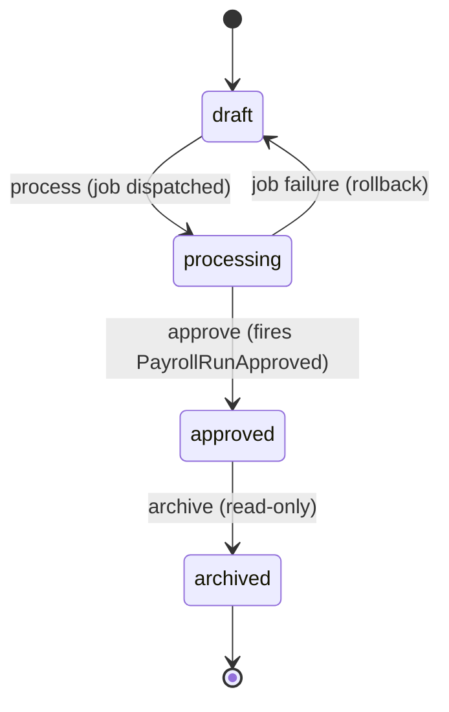
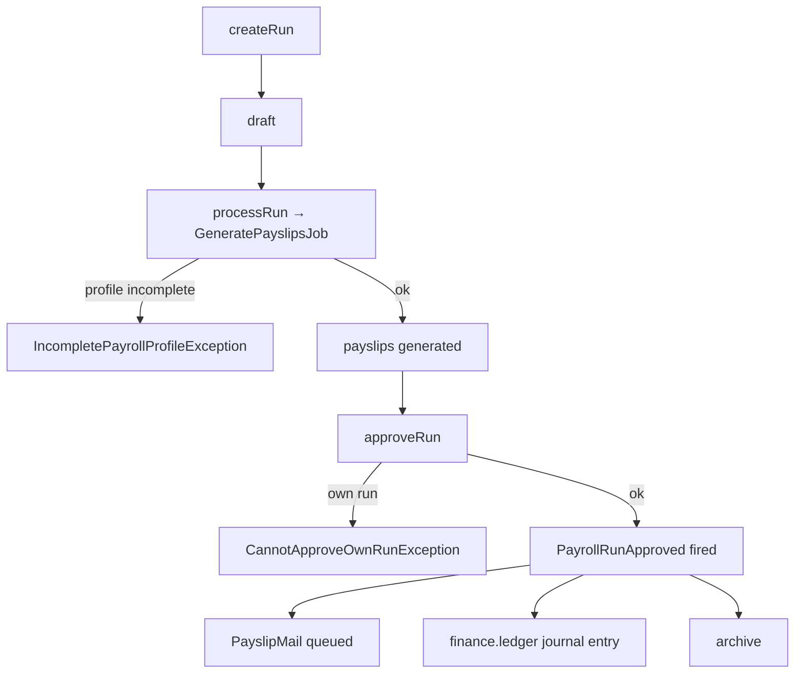

# Payroll — Architecture

Services, actions, and the payroll run state machine. See [[_module]].

---

## Services & Actions

Interface→Service per [[../../../architecture/patterns/interface-service]]: `PayrollServiceInterface` → `PayrollService`.

| Method | Behavior |
|---|---|
| `createRun(CreatePayrollRunData $data): PayrollRunData` | creates a `draft` run; rejects duplicate period per company |
| `processRun(string $runId): void` | dispatches `GeneratePayslipsJob`; throws `IncompletePayrollProfileException` listing blockers |
| `approveRun(string $runId): PayrollRunData` | throws `CannotApproveOwnRunException`, `InvalidStateTransitionException`; fires `PayrollRunApproved` |
| `payslipsFor(string $employeeId): Collection<PayslipData>` | self-service path enforces own-scope |

Money math is **exclusively** `brick/money` (integer minor units) — see [[../../../architecture/packages]] and [[security]].

---

## Filament Artifacts

**Nav group:** Payroll

| Artifact | Kind ([[../../../architecture/ui-strategy]] row) | Blueprint / Tweaks | Notes |
|---|---|---|---|
| `PayrollRunResource` | #1 CRUD resource | tweaks: state-badge-column (run status machine), custom-header-actions (process / approve / archive), view-page-tabs (run detail: payslip list + employer-cost summary) | list: period, status, gross/net/employer-cost totals; new-run collected via a wizard form *(assumed)* ([[../../../architecture/patterns/page-blueprints#Wizard]]) |
| `PayslipResource` | #1 CRUD resource | tweaks: read-only-flow-owned (`GeneratePayslipsJob` owns writes), pdf-preview-panel | `amounts_raw` decryption gated by `hr.payroll.view-sensitive`; employee self-service is own-scope only |
| `PayrollEmployeeResource` | #1 CRUD resource | tweaks: state-badge-column (`incomplete` → `ready`) *(assumed)* | salary/IBAN masked unless `view-sensitive`; stub created by `EmployeeHired` |
| `DeductionTypeResource` | #1 CRUD resource | — | percent/flat config; managing gated by `hr.payroll.manage-deductions` |
| `PayrollRunWidget` | #6 dashboard widget | [[../../../architecture/patterns/page-blueprints#Dashboard]] | run summary stats; widget polling 30–60s |

**Access contract (mandatory):** every artifact gates on
`canAccess() = Auth::user()->can('hr.payroll.view-any') && BillingService::hasModule('hr.payroll')`
per [[../../../architecture/filament-patterns]] #1. `view-sensitive` additionally gates display/decryption of salary, IBAN, and payslip amounts. The employee-facing payslip archive is own-scope only (`payslipsFor` enforces). The payslip PDF export names the `exports` rate limiter and `PayslipMail` (queued on approve) the `panel-action` limiter (comms category) per [[security]]. Public/portal surfaces use a guest or scoped-portal guard (Vue+Inertia per [[../../../architecture/ui-strategy]]).

---

## Concurrency

| Write path | Tier | Mechanism |
|---|---|---|
| Payroll-employee CRUD (salary/IBAN/deduction form, API) | Optimistic | `updated_at` stale-check on save → `StaleRecordException` → conflict notification ([[../../../architecture/patterns/optimistic-locking]]) |
| Deduction-type CRUD | Optimistic | `updated_at` stale-check ([[../../../architecture/patterns/optimistic-locking]]) |
| Run state transition (process / approve / archive) | Pessimistic | `DB::transaction()` + `lockForUpdate()` on the run, re-read, validate, write; money mutation per [[../../../architecture/patterns/states]] |
| Payslip generation (money computation, `GeneratePayslipsJob`) | Pessimistic | run locked `lockForUpdate` during generation; idempotent upsert on `(payroll_run_id, employee_id)` unique — re-run safe; `brick/money` throughout |

Tiers per [[../../../decisions/decision-2026-07-02-optimistic-locking-standard]].

---

## State Machine

Column `hr_payroll_runs.status` → `PayrollRunState` (spatie/model-states, [[../../../architecture/patterns/states]]).

| State | Transitions to | Triggered by (permission) | Side effects |
|---|---|---|---|
| `draft` | `processing` | `hr.payroll.process` | payslip generation job dispatched |
| `processing` | `draft` | job failure | error surfaced, payslips rolled back |
| `processing` | `approved` | `hr.payroll.approve` (after payslips generated) | fires `PayrollRunApproved`; payslip mails queued |
| `approved` | `archived` | `hr.payroll.archive` | read-only |

Approver ≠ run creator *(assumed: four-eyes on payroll — see [[unknowns]])*. Transitions audited.

---

## Payroll Run Flow

---

## Related
- [[../../../architecture/patterns/states]]
- [[../../../architecture/patterns/interface-service]]
- [[api]] · [[data-model]]
