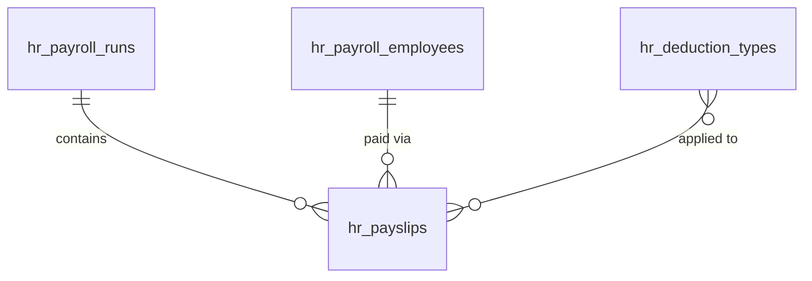

# Payroll — Data Model

Tables owned by this module. See [[_module]] · backed by [[../../../infrastructure/database]]. Encrypted columns marked 🔐 — see [[security]].

---

## hr_payroll_employees

*(new vs v1 spec — the per-employee payroll profile the `EmployeeHired` listener creates)*

| Column | Type | Constraints | Notes |
|---|---|---|---|
| id, company_id (indexed), employee_id FK unique | ulid | | |
| 🔐 salary_raw | text | nullable | encrypted integer cents (monthly gross) |
| salary_band | string | nullable | derived, coarse (reporting) |
| 🔐 iban | text | nullable | encrypted |
| pay_type | string | not null default `salaried` | salaried / hourly |
| 🔐 hourly_rate_raw | text | nullable | encrypted integer cents *(assumed)* |
| status | string | default `incomplete` | incomplete / ready |
| deleted_at | timestamp | nullable | |

## hr_payroll_runs

| Column | Type | Constraints | Notes |
|---|---|---|---|
| id, company_id (indexed) | ulid | | |
| period_start / period_end | date | not null | unique `(company_id, period_start)` |
| status | string | default `draft` | state machine |
| total_gross_cents / total_net_cents / total_employer_cost_cents | bigint | not null default 0 | |
| currency | string(3) | not null | |
| approved_by | ulid nullable FK users | | |
| approved_at | timestamp nullable | | |
| deleted_at | timestamp nullable | | |

## hr_payslips

| Column | Type | Notes |
|---|---|---|
| id, company_id (indexed), payroll_run_id FK, employee_id FK | ulid | unique `(payroll_run_id, employee_id)` |
| 🔐 amounts_raw | text | encrypted json: gross_cents, net_cents, employer_cost_cents, deductions[] |
| pdf_path | string nullable | tenant-scoped |
| deleted_at | timestamp nullable | kept 7 years per [[../../../architecture/data-lifecycle]] |

## hr_deduction_types

| Column | Type | Notes |
|---|---|---|
| id, company_id (indexed) | ulid | |
| name | string | |
| calculation_type | string | percent / flat |
| value | int | basis points for percent *(assumed)* / cents for flat |
| is_employer_contribution | boolean | |
| deleted_at | timestamp nullable | |

---

## ERD

---

## Related
- [[../../../infrastructure/database]]
- [[../../../security/tenancy-isolation]] — all tables `company_id`-scoped
- [[security]] · [[architecture]]
