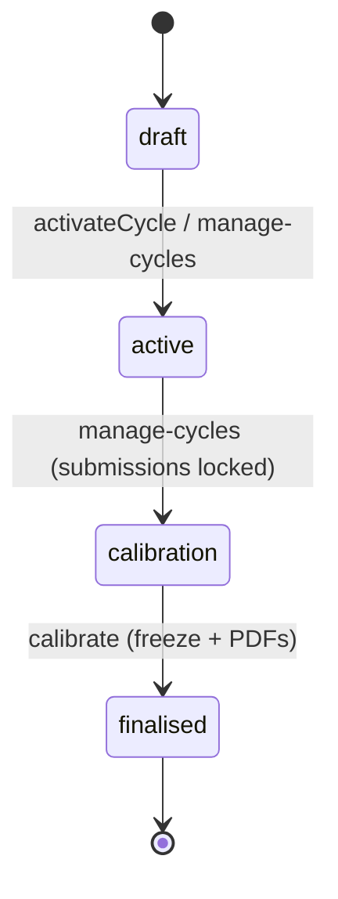

# Performance Reviews — Architecture

Intended design. Nothing built yet. See [[_module]].

## Services & Actions

Interface→Service binding: `PerformanceServiceInterface` → `PerformanceService`.

| Method | Behavior | Throws |
|---|---|---|
| `activateCycle(string $cycleId): void` | generates the review matrix (self + manager per employee; peers chosen by manager) | `EmptyCycleException` when no active employees |
| `submitReview(SubmitReviewData $data): void` | records a reviewer's submission | `ReviewLockedException` outside `active`, `NotYourReviewException` |
| `calibrate(CalibrateRatingData $data): void` | adjusts a rating; only in `calibration` state; audited | — |
| `finalise(string $cycleId): void` | freezes ratings, dispatches per-employee PDF jobs | — |

## Review Cycle State Machine

Column: `hr_review_cycles.status` — `ReviewCycleState` (spatie/laravel-model-states, see [[../../../architecture/patterns/states]]).

| State | → To | Trigger (permission) | Side effects |
|---|---|---|---|
| `draft` | `active` | `hr.performance.manage-cycles` | review rows generated (self + manager per employee; peers chosen by manager *(assumed)*); due notifications |
| `active` | `calibration` | `hr.performance.manage-cycles` | submissions locked |
| `calibration` | `finalised` | `hr.performance.calibrate` | ratings frozen; PDFs generated; employees see results |

## PDF Export

Per-employee cycle-outcome PDF via spatie/laravel-pdf ([[../../../architecture/packages|packages]]). Generated on `finalise` through `GenerateReviewReportPdfJob` (queue: exports, overwrites per employee). See [[features/pdf-export]].

## Jobs & Scheduling

| Job / Command | Queue | Schedule | Idempotency |
|---|---|---|---|
| `ReviewDueReminderCommand` | notifications | daily | pending reviews due in 3d / overdue, once per threshold |
| `GenerateReviewReportPdfJob` | exports | on finalise | overwrites per employee |

Queue infra: [[../../../infrastructure/queue-horizon]].

## Related

- [[data-model]]
- [[api]]
- [[_module]]
