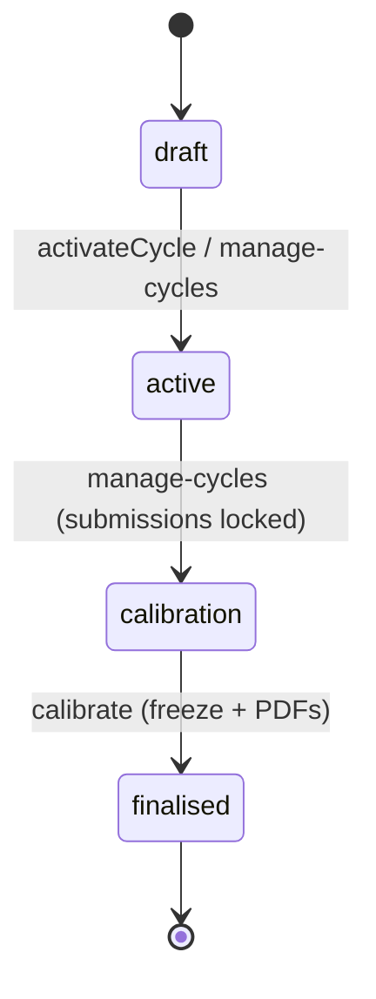

# Performance Reviews — Architecture

Intended design. Nothing built yet. See [[_module]].

## Services & Actions

Interface→Service binding: `PerformanceServiceInterface` → `PerformanceService`.

| Method | Behavior | Throws |
|---|---|---|
| `activateCycle(string $cycleId): void` | generates the review matrix (self + manager per employee; peers chosen by manager) | `EmptyCycleException` when no active employees |
| `submitReview(SubmitReviewData $data): void` | records a reviewer's submission | `ReviewLockedException` outside `active`, `NotYourReviewException` |
| `calibrate(CalibrateRatingData $data): void` | adjusts a rating; only in `calibration` state; audited | — |
| `finalise(string $cycleId): void` | freezes ratings, dispatches per-employee PDF jobs | — |

## Filament Artifacts

**Nav group:** Performance

| Artifact | Kind ([[../../../architecture/ui-strategy]] row) | Blueprint / Tweaks | Notes |
|---|---|---|---|
| `ReviewCycleResource` | #1 CRUD resource | tweaks: state-badge-column (cycle state machine), custom-header-actions (activate / move-to-calibration / finalise) | list: name, type, period, status, completion-%; finalise generates per-employee PDFs (`exports` limiter) |
| `ReviewResource` | #1 CRUD resource | tweaks: state-badge-column (cycle-driven mode: editable `active` / locked `calibration` / frozen `finalised`) *(assumed)*, custom-header-actions (submit), view-page-tabs (side-by-side self vs manager for calibration) *(assumed)* | reviewer sees own assigned reviews only; HR sees all + calibrates |
| `MyGoalsPage` | #17 Gallery / Directory grid *(assumed)* | [[../../../architecture/patterns/page-blueprints#Gallery / Directory Grid]] | self-service list of the employee's own goals with `progress_percent` control; own-scope only |

**Access contract (mandatory):** every artifact gates on
`canAccess() = Auth::user()->can('hr.performance.view-any') && BillingService::hasModule('hr.performance')`
per [[../../../architecture/filament-patterns]] #1. `MyGoalsPage` is a custom page and MUST state this explicitly — Filament does not auto-gate custom pages; its own gate is `hr.performance.view` + ownership (own `employee_id`). Reviewees see results only after the cycle is `finalised`; peer reviewer identity is never shown to the reviewee *(assumed)*. The `finalise` PDF generation names the `exports` rate limiter per [[security]]. Public/portal surfaces use a guest or scoped-portal guard (Vue+Inertia per [[../../../architecture/ui-strategy]]).

## Concurrency

| Write path | Tier | Mechanism |
|---|---|---|
| Review-cycle CRUD (form, API) | Optimistic | `updated_at` stale-check on save → `StaleRecordException` → conflict notification ([[../../../architecture/patterns/optimistic-locking]]) |
| Review submission (`submitReview`) | Optimistic | `updated_at` stale-check; cycle-state guard raises `ReviewLockedException` outside `active` ([[../../../architecture/patterns/optimistic-locking]]) |
| Goal progress update (`MyGoalsPage`) | Optimistic | `updated_at` stale-check ([[../../../architecture/patterns/optimistic-locking]]) |
| Rating calibration (`calibrate`) | Optimistic | `updated_at` stale-check; only writable in `calibration` state |
| Cycle state transition (activate / move-to-calibration / finalise) | Pessimistic | `DB::transaction()` + `lockForUpdate()` on the cycle, re-read, validate, write per [[../../../architecture/patterns/states]] |

Tiers per [[../../../decisions/decision-2026-07-02-optimistic-locking-standard]].

## Review Cycle State Machine

Column: `hr_review_cycles.status` — `ReviewCycleState` (spatie/laravel-model-states, see [[../../../architecture/patterns/states]]).

| State | → To | Trigger (permission) | Side effects |
|---|---|---|---|
| `draft` | `active` | `hr.performance.manage-cycles` | review rows generated (self + manager per employee; peers chosen by manager *(assumed)*); due notifications |
| `active` | `calibration` | `hr.performance.manage-cycles` | submissions locked |
| `calibration` | `finalised` | `hr.performance.calibrate` | ratings frozen; PDFs generated; employees see results |

## PDF Export

Per-employee cycle-outcome PDF via spatie/laravel-pdf ([[../../../architecture/packages|packages]]). Generated on `finalise` through `GenerateReviewReportPdfJob` (queue: exports, overwrites per employee). See [[features/pdf-export]].

## Jobs & Scheduling

| Job / Command | Queue | Schedule | Idempotency |
|---|---|---|---|
| `ReviewDueReminderCommand` | notifications | daily | pending reviews due in 3d / overdue, once per threshold |
| `GenerateReviewReportPdfJob` | exports | on finalise | overwrites per employee |

Queue infra: [[../../../infrastructure/queue-horizon]].

## Related

- [[data-model]]
- [[api]]
- [[_module]]
