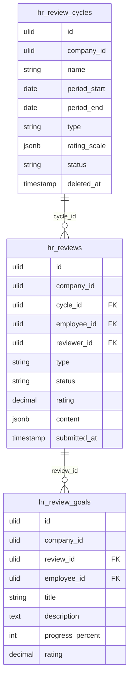

# Performance Reviews — Data Model

Intended tables. Nothing migrated yet. See [[_module]]. Infra: [[../../../infrastructure/database]].

## hr_review_cycles

| Column | Type | Notes |
|---|---|---|
| id, company_id (indexed) | ulid | |
| name | string | |
| period_start / period_end | date | |
| type | string | annual / bi-annual / quarterly |
| rating_scale | jsonb | labels, default 1–5 *(assumed)* |
| status | string default `draft` | state machine ([[architecture]]) |
| deleted_at | timestamp nullable | |

## hr_reviews

| Column | Type | Notes |
|---|---|---|
| id, company_id (indexed), cycle_id FK, employee_id FK, reviewer_id FK | ulid | unique `(cycle_id, employee_id, reviewer_id, type)` |
| type | string | self / manager / peer |
| status | string default `pending` | pending / submitted |
| rating | decimal(3,1) nullable | calibratable |
| content | jsonb | answers per question *(assumed: question set on cycle)* |
| submitted_at | timestamp nullable | |

## hr_review_goals

| Column | Type | Notes |
|---|---|---|
| id, company_id, review_id FK, employee_id FK | ulid | |
| title / description | string / text | |
| progress_percent | int default 0 | 0–100 |
| rating | decimal(3,1) nullable | |

## ERD

`employee_id` / `reviewer_id` reference employees in [[../employee-profiles/_module|hr.profiles]]. Every table carries `company_id` for [[../../../security/tenancy-isolation|tenant isolation]].

## Related

- [[architecture]]
- [[_module]]
