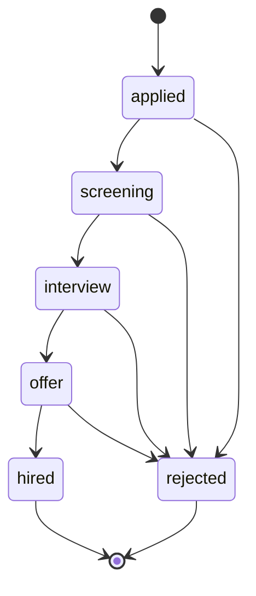
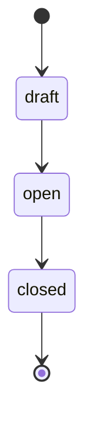
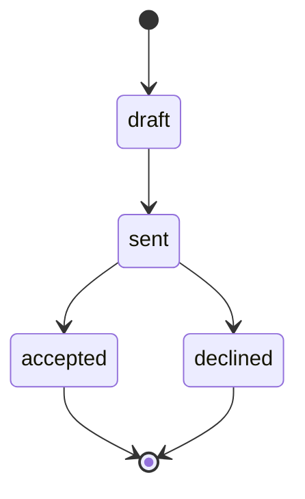

# Recruitment — Architecture

Intended service topology and state machines. Nothing built yet — see [[_module]].

Patterns: [[../../../architecture/patterns/interface-service]] · [[../../../architecture/patterns/states]] · [[../../../architecture/patterns/custom-pages]].

---

## Services & Actions

Interface → Service binding: `RecruitmentServiceInterface` → `RecruitmentService`.

| Method | Intent |
|---|---|
| `openRequisition(CreateRequisitionData): RequisitionData` | create/approve a requisition |
| `apply(ApplyData): ApplicantData` | public path; company resolved from requisition slug |
| `moveStage(string $applicantId, string $state): ApplicantData` | pipeline transition (guards via state machine) |
| `makeOffer(CreateOfferData): OfferData` / `sendOffer(string $offerId)` | offer create + send |
| `hire(string $applicantId): EmployeeData` | delegates to `EmployeeService::hire`; closes requisition when headcount filled |

Full DTO shapes in [[api]].

---

## State Machine — Applicant pipeline

Column: `hr_applicants.status` — `ApplicantState`. Initial: `applied`. Terminal: `hired`, `rejected`. Audited.

| State | → | Trigger (permission) | Side effects |
|---|---|---|---|
| `applied` | `screening` | `hr.recruitment.update` | |
| `screening` | `interview` | `hr.recruitment.update` | |
| `interview` | `offer` | `hr.recruitment.update` | offer record expected |
| `offer` | `hired` | `hr.recruitment.hire` | converts to employee via `EmployeeService::hire` |
| any non-terminal | `rejected` | `hr.recruitment.update` | rejection mail *(assumed: optional toggle)* |

Invalid stage jumps (e.g. `applied → offer`) must be rejected by the machine.

---

## Requisition & Offer statuses

These are plain string statuses (no dedicated state-machine classes in the spec).

Requisition: `draft` → `open` → `closed` (auto-closes when headcount filled during hire).

Offer: `draft` → `sent` → `accepted` / `declined`.

---

## Jobs & Scheduling

| Job / Command | Queue | Schedule | Idempotency |
|---|---|---|---|
| `PurgeStaleApplicantsCommand` | default | weekly | rejected/withdrawn > 12 months, date guard |
| Offer / rejection mails | notifications | on action | — |

Queue infra: [[../../../infrastructure/queue-horizon]]. Mail: [[../../../infrastructure/mail]].

---

## Filament artifacts

Nav group: **Employees**.

| Artifact | Kind | Notes |
|---|---|---|
| `JobRequisitionResource` | CRUD | publish toggle |
| `ApplicantPipelinePage` | Kanban custom page | per-requisition columns by state; drag = `moveStage`; polling 30s (not collaborative enough for Reverb) |
| `ApplicantResource` | CRUD | list + CV preview |
| `InterviewResource` | CRUD | schedule + outcome |
| `OfferResource` | CRUD | create, send, track |

Public careers pages: Vue + Inertia (`/careers`, `/careers/{slug}`).

---

## Related

- [[_module]] · [[data-model]] · [[api]] · [[security]]
