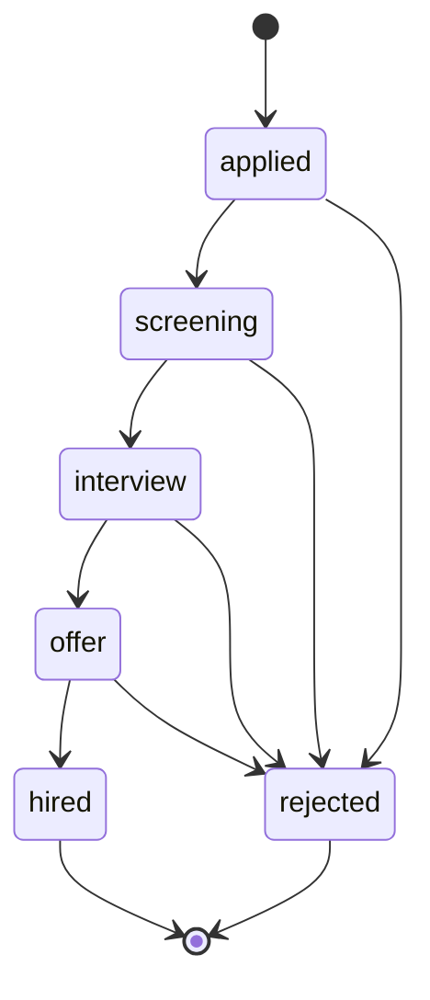
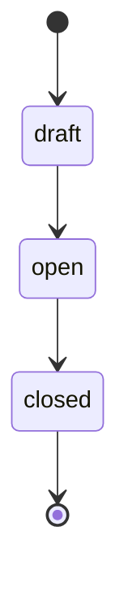
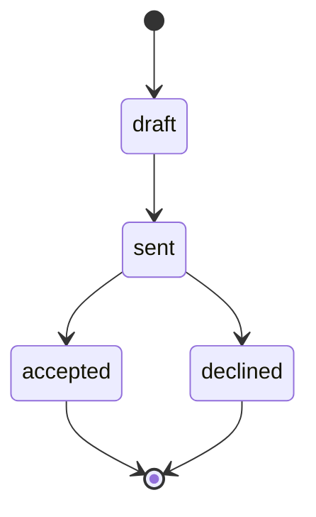

# Recruitment — Architecture

Intended service topology and state machines. Nothing built yet — see [[_module]].

Patterns: [[../../../architecture/patterns/interface-service]] · [[../../../architecture/patterns/states]] · [[../../../architecture/patterns/custom-pages]].

---

## Services & Actions

Interface → Service binding: `RecruitmentServiceInterface` → `RecruitmentService`.

| Method | Intent |
|---|---|
| `openRequisition(CreateRequisitionData): RequisitionData` | create/approve a requisition |
| `apply(ApplyData): ApplicantData` | public path; company resolved from requisition slug |
| `moveStage(string $applicantId, string $state): ApplicantData` | pipeline transition (guards via state machine) |
| `makeOffer(CreateOfferData): OfferData` / `sendOffer(string $offerId)` | offer create + send |
| `hire(string $applicantId): EmployeeData` | delegates to `EmployeeService::hire`; closes requisition when headcount filled |

Full DTO shapes in [[api]].

---

## State Machine — Applicant pipeline

Column: `hr_applicants.status` — `ApplicantState`. Initial: `applied`. Terminal: `hired`, `rejected`. Audited.

| State | → | Trigger (permission) | Side effects |
|---|---|---|---|
| `applied` | `screening` | `hr.recruitment.update` | |
| `screening` | `interview` | `hr.recruitment.update` | |
| `interview` | `offer` | `hr.recruitment.update` | offer record expected |
| `offer` | `hired` | `hr.recruitment.hire` | converts to employee via `EmployeeService::hire` |
| any non-terminal | `rejected` | `hr.recruitment.update` | rejection mail *(assumed: optional toggle)* |

Invalid stage jumps (e.g. `applied → offer`) must be rejected by the machine.

---

## Requisition & Offer statuses

These are plain string statuses (no dedicated state-machine classes in the spec).

Requisition: `draft` → `open` → `closed` (auto-closes when headcount filled during hire).

Offer: `draft` → `sent` → `accepted` / `declined`.

---

## Jobs & Scheduling

| Job / Command | Queue | Schedule | Idempotency |
|---|---|---|---|
| `PurgeStaleApplicantsCommand` | default | weekly | rejected/withdrawn > 12 months, date guard |
| Offer / rejection mails | notifications | on action | — |

Queue infra: [[../../../infrastructure/queue-horizon]]. Mail: [[../../../infrastructure/mail]].

---

## Filament Artifacts

**Nav group:** Employees

| Artifact | Kind ([[../../../architecture/ui-strategy]] row) | Blueprint / Tweaks | Notes |
|---|---|---|---|
| `JobRequisitionResource` | #1 CRUD resource | tweaks: state-badge-column (draft/open/closed), custom-header-actions (publish toggle) | auto-closes when headcount filled during hire |
| `ApplicantPipelinePage` | #3 Kanban custom page | [[../../../architecture/patterns/page-blueprints#Kanban]] | per-requisition columns by state; drag = `moveStage`; **realtime deviation**: polling 30s instead of the blueprint's Reverb default (not collaborative enough) — justified in [[security]] |
| `ApplicantResource` | #1 CRUD resource | tweaks: state-badge-column, pdf-preview-panel (CV preview) | list + CV preview |
| `InterviewResource` | #1 CRUD resource | — | schedule + outcome |
| `OfferResource` | #1 CRUD resource | tweaks: state-badge-column (draft/sent/accepted/declined), custom-header-actions (send offer) | encrypted salary; send names the `panel-action` comms limiter |

Public careers pages are Vue + Inertia (`/careers`, `/careers/{slug}`, `/careers/{slug}/apply`) — ui-strategy rows #12/#16, guest guard (not Filament).

**Access contract (mandatory):** every Filament artifact gates on
`canAccess() = Auth::user()->can('hr.recruitment.view-any') && BillingService::hasModule('hr.recruitment')`
per [[../../../architecture/filament-patterns]] #1. `ApplicantPipelinePage` is a custom page and MUST state this explicitly — Filament does not auto-gate custom pages. Pipeline moves require `hr.recruitment.update`, the hire transition `hr.recruitment.hire`, offer actions `hr.recruitment.manage-offers`. Offer/rejection mails name the `panel-action` (comms) limiter; the public apply path uses a guest guard + the `public-apply` limiter and the CV upload contract per [[security]].

## Concurrency

| Write path | Tier | Mechanism |
|---|---|---|
| Requisition / applicant / interview / offer CRUD (form, API) | Optimistic | `updated_at` stale-check on save → `StaleRecordException` → conflict notification ([[../../../architecture/patterns/optimistic-locking]]) |
| Public apply (create applicant) | Optimistic | new-record create; no stale target — guest path, `public-apply` limiter guards abuse |
| Applicant pipeline transition (`moveStage`) | Pessimistic | `DB::transaction()` + `lockForUpdate()`, re-read, validate per [[../../../architecture/patterns/states]] |
| Offer status transition (send / accept / decline) | Pessimistic | `DB::transaction()` + `lockForUpdate()` per [[../../../architecture/patterns/states]] |
| Hire (`offer → hired`, headcount decrement + requisition auto-close) | Pessimistic | requisition locked `lockForUpdate`; capacity decrement; delegates to `EmployeeService::hire` |

Tiers per [[../../../decisions/decision-2026-07-02-optimistic-locking-standard]].

---

## Related

- [[_module]] · [[data-model]] · [[api]] · [[security]]
