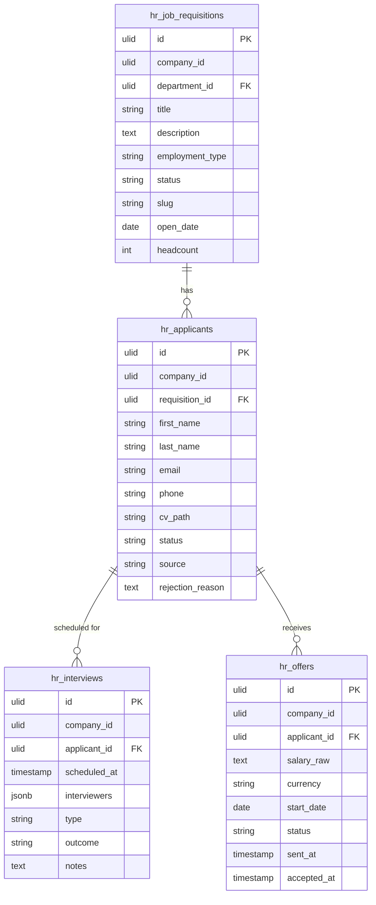

# Recruitment — Data Model

Four tables, all ULID PKs, all `BelongsToCompany` + `SoftDeletes`. Not yet migrated — see [[_module]]. Infra: [[../../../infrastructure/database]].

---

## hr_job_requisitions

| Column | Type | Notes |
|---|---|---|
| id, company_id (indexed), department_id FK nullable | ulid | |
| title | string | |
| description | text | published to careers page |
| employment_type | string | full-time / part-time / contractor |
| status | string default `draft` | draft / open / closed |
| slug | string | sluggable, unique per company — careers URL |
| open_date | date nullable | |
| headcount | int default 1 | |
| deleted_at | timestamp nullable | |

## hr_applicants

| Column | Type | Notes |
|---|---|---|
| id, company_id (indexed), requisition_id FK | ulid | |
| first_name / last_name / email / phone | string (phone E.164) | |
| cv_path | string nullable | via core.files |
| status | string default `applied` | state machine |
| source | string nullable | careers / referral / manual |
| rejection_reason | text nullable | *(assumed)* |
| deleted_at | timestamp nullable | |

**Indexes:** `(company_id, requisition_id, status)`

## hr_interviews

| Column | Type | Notes |
|---|---|---|
| id, company_id, applicant_id FK | ulid | |
| scheduled_at | timestamp | |
| interviewers | jsonb | user ids |
| type | string | video / phone / on-site |
| outcome | string nullable | pass / fail / pending |
| notes | text nullable | |

## hr_offers

| Column | Type | Notes |
|---|---|---|
| id, company_id, applicant_id FK | ulid | |
| 🔐 salary_raw | text | encrypted cast — minor-unit integer stored as encrypted string (brick/money for arithmetic). See [[security]] + [[../../../security/encryption]] |
| currency | string(3) | |
| start_date | date | |
| status | string default `draft` | draft / sent / accepted / declined |
| sent_at / accepted_at | timestamp nullable | |

---

## ERD

---

## Related

- [[_module]] · [[architecture]] · [[security]]
