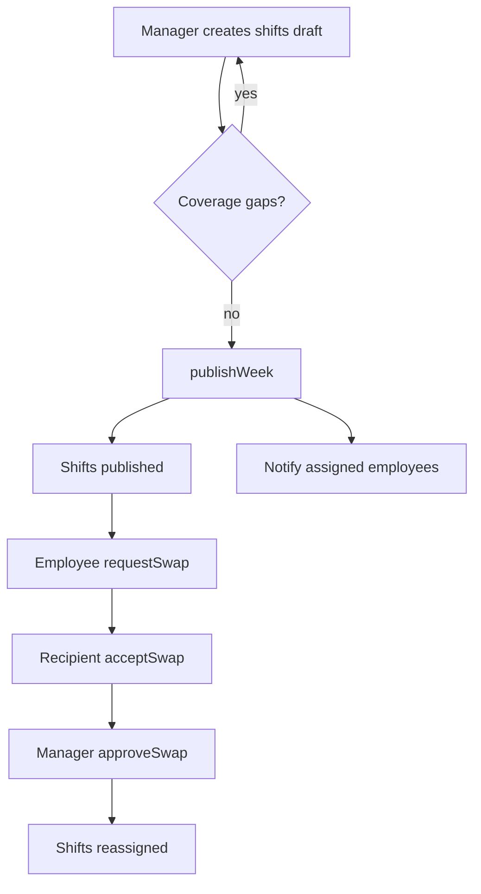
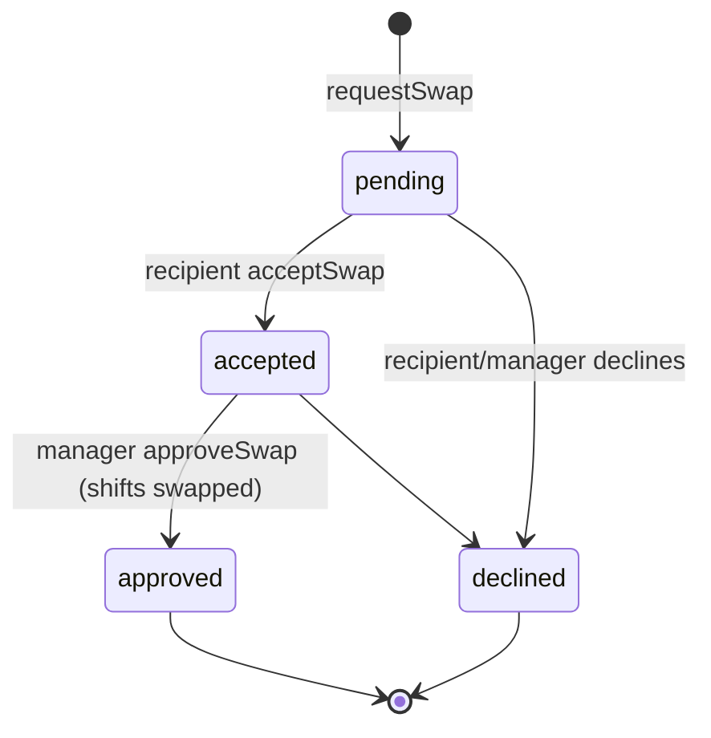

# Shift Scheduling — Architecture

Intended design (not yet built). See [[_module]].

## Services & Actions

Interface→Service binding: `ShiftServiceInterface` → `ShiftService`.

| Method | Intended behavior | Throws |
|---|---|---|
| `createShift(CreateShiftData): ShiftData` | create a shift; validate span, overlap, leave | `ShiftConflictException`, `EmployeeOnLeaveException` |
| `publishWeek(CarbonImmutable $weekStart): int` | flip that week's drafts → published, notify assigned employees | |
| `copyWeek(CarbonImmutable $from, $to): int` | copy shifts into target week as drafts; skip employees on leave | |
| `requestSwap(RequestSwapData)` / `acceptSwap(...)` / `approveSwap(...)` | swap lifecycle; final approval reassigns shifts | |
| `coverageGaps(CarbonImmutable $weekStart): Collection<ShiftData>` | list unassigned shifts for the week | |

## Filament Artifacts

**Nav group:** Leave

| Artifact | Kind ([[../../../architecture/ui-strategy]] row) | Blueprint / Tweaks | Notes |
|---|---|---|---|
| `ShiftSchedulePage` | #4 Calendar custom page | [[../../../architecture/patterns/page-blueprints#Calendar]] | fullcalendar week view; drag-drop assignment; coverage-gap highlighting; publish + copy-week header actions; polling 30s |
| `ShiftSwapRequestResource` | #1 CRUD resource | tweaks: state-badge-column (pending/accepted/approved/declined), custom-header-actions (accept / approve / decline) | swap lifecycle; approval reassigns shifts |

**Access contract (mandatory):** every artifact gates on
`canAccess() = Auth::user()->can('hr.shifts.view-any') && BillingService::hasModule('hr.shifts')`
per [[../../../architecture/filament-patterns]] #1. `ShiftSchedulePage` is a custom page and MUST state this explicitly — Filament does not auto-gate custom pages. Shift edits require `hr.shifts.create`/`.update`, publish `hr.shifts.publish`, swap request `hr.shifts.request-swap`, swap approval `hr.shifts.approve-swap`. Publish notifies assigned employees — names the `panel-action` (comms) limiter per [[security]]. Public/portal surfaces use a guest or scoped-portal guard (Vue+Inertia per [[../../../architecture/ui-strategy]]).

## Custom Scheduling Page

`ShiftSchedulePage` — Filament custom page, ui-strategy row #4 (Calendar). Pattern: [[../../../architecture/patterns/custom-pages]].

- fullcalendar week view (`saade/filament-fullcalendar`)
- drag-drop assignment, coverage-gap highlighting
- publish + copy-week header actions
- 30s polling for near-live updates
- explicit `canAccess()` (see [[security]])

The swap CRUD surface is `ShiftSwapRequestResource` (ui-strategy row #1) with an approve action.

## Concurrency

| Write path | Tier | Mechanism |
|---|---|---|
| Shift create / assignment (form, drag-drop) | Pessimistic | overlap + leave guard: `lockForUpdate` on the employee's shifts in range → `ShiftConflictException` / `EmployeeOnLeaveException` |
| Publish week / copy week | Optimistic | `updated_at` stale-check per shift; batch draft → published flip ([[../../../architecture/patterns/optimistic-locking]]) |
| Swap request / accept (`hr_shift_swap_requests` status) | Optimistic | `updated_at` stale-check ([[../../../architecture/patterns/optimistic-locking]]) |
| Swap approval (`approveSwap` — reassigns shifts) | Pessimistic | `DB::transaction()` + `lockForUpdate()` on both shifts, re-validate overlap, reassign |
| Leave-conflict unassign (`BlockShiftsOnLeaveListener`) | Pessimistic | `lockForUpdate` on shifts overlapping the approved leave range before unassigning |

Tiers per [[../../../decisions/decision-2026-07-02-optimistic-locking-standard]].

## Shift Publish + Swap Flow

## Swap Request State Diagram

`hr_shift_swap_requests.status` is a plain string field — linear flow, no spatie/model-states *(assumed)*.

## Related

- [[api]] · [[data-model]] · [[security]]
- [[../../../architecture/patterns/custom-pages]]
- [[../../../architecture/event-bus]]
