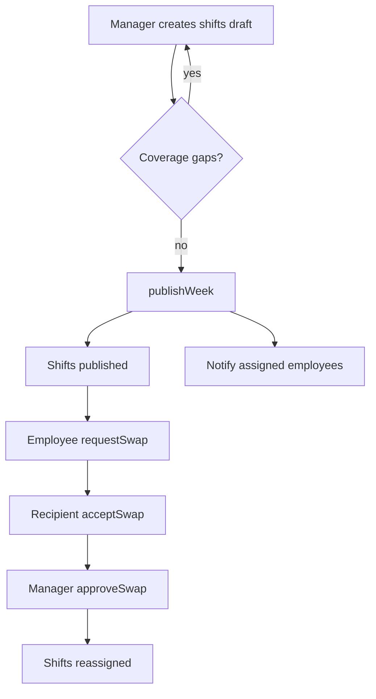
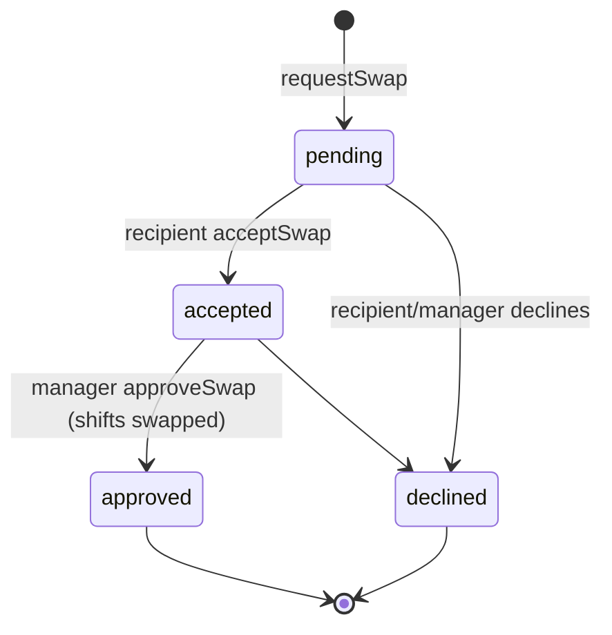

# Shift Scheduling — Architecture

Intended design (not yet built). See [[_module]].

## Services & Actions

Interface→Service binding: `ShiftServiceInterface` → `ShiftService`.

| Method | Intended behavior | Throws |
|---|---|---|
| `createShift(CreateShiftData): ShiftData` | create a shift; validate span, overlap, leave | `ShiftConflictException`, `EmployeeOnLeaveException` |
| `publishWeek(CarbonImmutable $weekStart): int` | flip that week's drafts → published, notify assigned employees | |
| `copyWeek(CarbonImmutable $from, $to): int` | copy shifts into target week as drafts; skip employees on leave | |
| `requestSwap(RequestSwapData)` / `acceptSwap(...)` / `approveSwap(...)` | swap lifecycle; final approval reassigns shifts | |
| `coverageGaps(CarbonImmutable $weekStart): Collection<ShiftData>` | list unassigned shifts for the week | |

## Custom Scheduling Page

`ShiftSchedulePage` — Filament custom page, ui-strategy row #4 (Calendar). Pattern: [[../../../architecture/patterns/custom-pages]].

- fullcalendar week view (`saade/filament-fullcalendar`)
- drag-drop assignment, coverage-gap highlighting
- publish + copy-week header actions
- 30s polling for near-live updates
- explicit `canAccess()` (see [[security]])

The swap CRUD surface is `ShiftSwapRequestResource` (ui-strategy row #1) with an approve action.

## Shift Publish + Swap Flow

## Swap Request State Diagram

`hr_shift_swap_requests.status` is a plain string field — linear flow, no spatie/model-states *(assumed)*.

## Related

- [[api]] · [[data-model]] · [[security]]
- [[../../../architecture/patterns/custom-pages]]
- [[../../../architecture/event-bus]]
