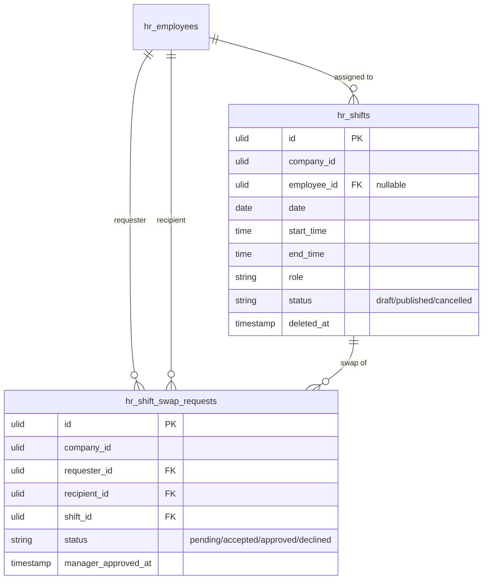

# Shift Scheduling — Data Model

Two tenant-scoped tables (planned). See [[../../../security/tenancy-isolation]] and [[../../../infrastructure/database]].

## hr_shifts

| Column | Type | Constraints | Notes |
|---|---|---|---|
| id | ulid | pk | |
| company_id | ulid | indexed | tenant scope |
| employee_id | ulid | nullable FK | null = unassigned (coverage gap) |
| date | date | not null | |
| start_time | time | not null | |
| end_time | time | end after start | overnight: `end_next_day` flag *(assumed)* |
| role | string | not null | position label |
| status | string | default `draft` | draft / published / cancelled |
| deleted_at | timestamp | nullable | soft delete |

**Indexes:** `(company_id, date, status)`, `(company_id, employee_id, date)`

## hr_shift_swap_requests

| Column | Type | Notes |
|---|---|---|
| id | ulid | pk |
| company_id | ulid | indexed, tenant scope |
| requester_id | ulid FK hr_employees | |
| recipient_id | ulid FK hr_employees | |
| shift_id | ulid FK hr_shifts | |
| status | string default `pending` | pending / accepted / approved / declined |
| manager_approved_at | timestamp nullable | set on final approval |

## ERD

## Related

- [[api]] · [[architecture]] · [[security]]
- [[../../../infrastructure/database]]
