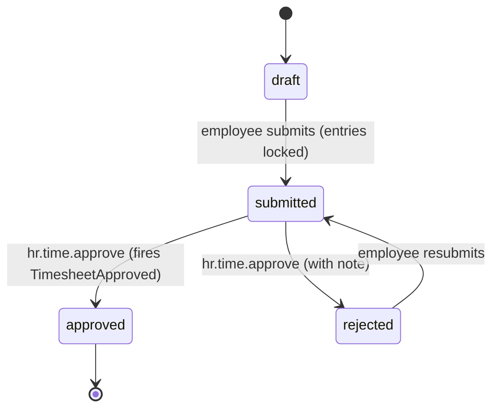

# Architecture — Time & Attendance

Planned (not built). Interface→Service pattern; timesheet lifecycle via [[../../../architecture/patterns/states|state machine]].

## Services & Actions

Interface→Service binding: `TimeServiceInterface` → `TimeService`.

- `clockIn(string $employeeId): TimeEntryData` — throws `AlreadyClockedInException`
- `clockOut(string $employeeId): TimeEntryData` — computes totals + overtime flag
- `logEntry(LogTimeEntryData $data): TimeEntryData` — manual entry
- `submitWeek(SubmitTimesheetData $data): TimesheetData`
- `approve(string $timesheetId): TimesheetData` — intended to fire `TimesheetApproved`; throws own-approval + state exceptions
- `reject(string $timesheetId, string $note): TimesheetData`

## Filament Artifacts

**Nav group:** Leave

| Artifact | Kind ([[../../../architecture/ui-strategy]] row) | Blueprint / Tweaks | Notes |
|---|---|---|---|
| `TimesheetResource` | #1 CRUD resource | tweaks: state-badge-column (draft/submitted/approved/rejected), custom-header-actions (submit / approve / reject) | pending-approval tab; approve fires `TimesheetApproved`; export names the `exports` limiter |
| `TimeEntryResource` | #1 CRUD resource | — | entries list, filters by employee/date; employees see own entries only (`log-own`) |
| `ClockWidget` | #6 dashboard widget | [[../../../architecture/patterns/page-blueprints#Dashboard]] | self-service clock in/out button + running timer |

**Access contract (mandatory):** every artifact gates on
`canAccess() = Auth::user()->can('hr.time.view-any') && BillingService::hasModule('hr.time')`
per [[../../../architecture/filament-patterns]] #1. Employees log/view/submit only their own entries (`hr.time.log-own`, `hr.time.submit-own`); approval requires `hr.time.approve` with **approver ≠ owner** enforced and audited. Timesheet export names the `exports` rate limiter per [[security]]. Public/portal surfaces (self-service clock timer) use a scoped-portal guard (Vue+Inertia per [[../../../architecture/ui-strategy]]).

## Concurrency

| Write path | Tier | Mechanism |
|---|---|---|
| Time-entry CRUD / manual log (own) | Optimistic | `updated_at` stale-check on save → `StaleRecordException` → conflict notification ([[../../../architecture/patterns/optimistic-locking]]) |
| Clock in / out | Optimistic | `updated_at` stale-check; `AlreadyClockedInException` guards a duplicate open entry ([[../../../architecture/patterns/optimistic-locking]]) |
| Timesheet state transition (submit / approve / reject) | Pessimistic | `DB::transaction()` + `lockForUpdate()`, re-read, validate; approver ≠ owner per [[../../../architecture/patterns/states]] |

Tiers per [[../../../decisions/decision-2026-07-02-optimistic-locking-standard]].

## Timesheet State Machine

Column: `hr_timesheets.status` — `TimesheetState`. Approver ≠ owner. Audited.

| State | Transitions to | Triggered by (permission) | Side effects |
|---|---|---|---|
| `draft` | `submitted` | employee (own) | entries locked |
| `submitted` | `approved` | `hr.time.approve` (manager) | intended to fire `TimesheetApproved` |
| `submitted` | `rejected` | `hr.time.approve` | back to employee with note, entries unlocked |
| `rejected` | `submitted` | employee (own) | |

## Related

- [[data-model]]
- [[api]]
- [[../../../architecture/patterns/states]]
- [[_module]]
