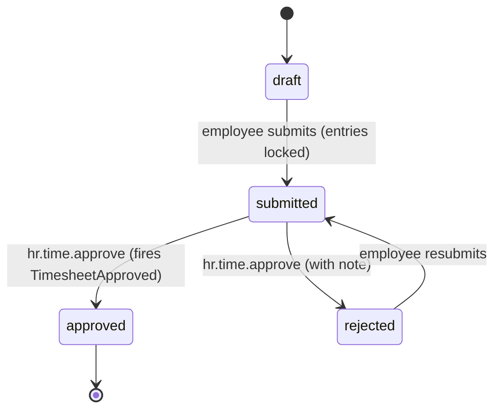

# Architecture — Time & Attendance

Planned (not built). Interface→Service pattern; timesheet lifecycle via [[../../../architecture/patterns/states|state machine]].

## Services & Actions

Interface→Service binding: `TimeServiceInterface` → `TimeService`.

- `clockIn(string $employeeId): TimeEntryData` — throws `AlreadyClockedInException`
- `clockOut(string $employeeId): TimeEntryData` — computes totals + overtime flag
- `logEntry(LogTimeEntryData $data): TimeEntryData` — manual entry
- `submitWeek(SubmitTimesheetData $data): TimesheetData`
- `approve(string $timesheetId): TimesheetData` — intended to fire `TimesheetApproved`; throws own-approval + state exceptions
- `reject(string $timesheetId, string $note): TimesheetData`

## Timesheet State Machine

Column: `hr_timesheets.status` — `TimesheetState`. Approver ≠ owner. Audited.

| State | Transitions to | Triggered by (permission) | Side effects |
|---|---|---|---|
| `draft` | `submitted` | employee (own) | entries locked |
| `submitted` | `approved` | `hr.time.approve` (manager) | intended to fire `TimesheetApproved` |
| `submitted` | `rejected` | `hr.time.approve` | back to employee with note, entries unlocked |
| `rejected` | `submitted` | employee (own) | |

## Related

- [[data-model]]
- [[api]]
- [[../../../architecture/patterns/states]]
- [[_module]]
