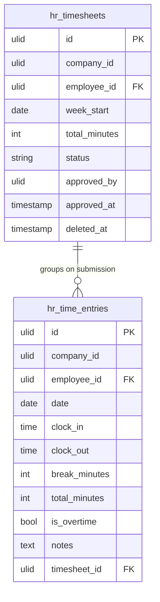

# Data Model — Time & Attendance

Two planned tables. See [[../../../infrastructure/database]] for conventions; tenant scoping per [[../../../security/tenancy-isolation]].

## hr_time_entries

| Column | Type | Constraints | Notes |
|---|---|---|---|
| id, company_id (indexed), employee_id FK | ulid | | |
| date | date | not null | |
| clock_in / clock_out | time | clock_out after clock_in | nullable while running |
| break_minutes | int | default 0 | |
| total_minutes | int | computed on close | minutes, not decimal hours |
| is_overtime | boolean | default false | |
| notes | text | nullable | |
| timesheet_id | ulid | nullable FK | linked on submission |

**Indexes:** `(company_id, employee_id, date)` unique *(assumed: one entry per day v1; multiple via separate rows if needed → relax later)*

## hr_timesheets

| Column | Type | Notes |
|---|---|---|
| id, company_id (indexed), employee_id FK | ulid | unique `(company_id, employee_id, week_start)` |
| week_start | date | Monday per company week-start setting |
| total_minutes | int | sum of entries |
| status | string default `draft` | state machine → [[architecture]] |
| approved_by | ulid nullable | |
| approved_at | timestamp nullable | |
| deleted_at | timestamp nullable | |

## ERD

## Related

- [[architecture]]
- [[../../../infrastructure/database]]
- [[../../../security/tenancy-isolation]]
- [[_module]]
