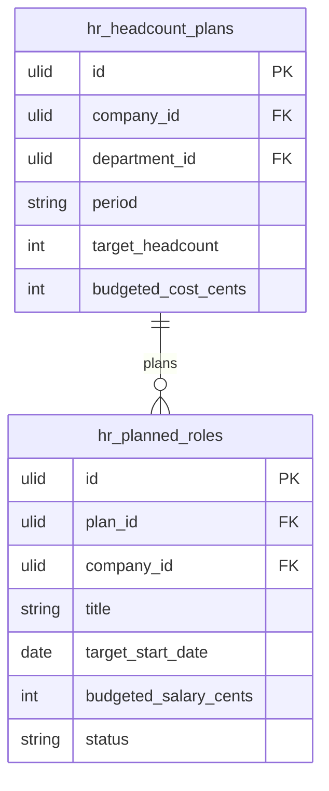

# Workforce Planning

Headcount planning, hire forecasts, and open role pipeline. Plan future team structure against budget and growth targets.

## Core Features

- Headcount plan: target headcount per department per period (quarter/year)
- Planned vs actual headcount tracking
- Hire forecast: planned new roles with target start dates and budgeted cost
- Open role pipeline: roles approved but not yet filled (links to Recruitment)
- Attrition forecast: expected departures factored into net headcount
- Budget impact: planned headcount × average salary vs department budget
- Scenario planning: best/expected/worst-case growth
- Org growth visualisation over time

## Data Model

| Table | Key Columns |
|---|---|
| `hr_headcount_plans` | company_id, department_id, period, target_headcount, budgeted_cost_cents |
| `hr_planned_roles` | company_id, plan_id, title, target_start_date, budgeted_salary_cents, status (planned/approved/filled) |

## Filament

**Nav group:** Analytics

- `HeadcountPlanResource` — plan headcount per department/period
- `PlannedRoleResource` — manage open role pipeline
- `WorkforcePlanningDashboard` (custom page) — planned vs actual headcount charts

## Cross-Domain

- Planned roles feed [[domains/hr/recruitment]] requisitions
- Budget check against [[domains/finance/budgets]]

## Related

- [[domains/hr/recruitment]]
- [[domains/hr/hr-analytics]]
- [[domains/finance/budgets]]
