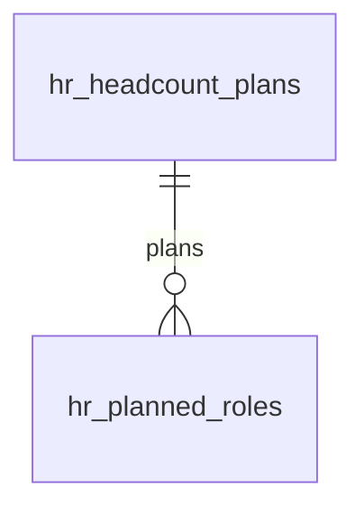

# Workforce Planning

Headcount planning, hire forecasts, and open role pipeline. Plan future team structure against budget and growth targets.

---

## Dependencies

| Type | Module | Why |
|---|---|---|
| Hard | [[domains/hr/employee-profiles\|hr.profiles]] | actual headcount baseline |
| Hard | [[domains/core/billing-engine\|core.billing]] + [[domains/core/rbac\|core.rbac]] | gating + permissions |
| Soft | [[domains/hr/recruitment\|hr.recruitment]] | approved planned roles convert to requisitions; without it status tracked manually |
| Soft | [[domains/finance/budgets\|finance.budgets]] | budget comparison column; hidden without it |

---

## Core Features

- Headcount plan: target headcount per department per period (quarter/year)
- Planned vs actual headcount tracking
- Hire forecast: planned new roles with target start dates and budgeted cost
- Open role pipeline: roles approved but not yet filled (links to Recruitment)
- Attrition forecast: expected departures factored into net headcount
- Budget impact: planned headcount × average salary vs department budget
- Scenario planning: best/expected/worst-case growth *(assumed: multiplier presets, not separate plan rows)*
- Org growth visualisation over time

---

## Data Model

### hr_headcount_plans

| Column | Type | Notes |
|---|---|---|
| id, company_id (indexed) | ulid | |
| department_id | ulid nullable FK | null = company-wide |
| period | string | e.g. `2026-Q3` / `2027`; unique `(company_id, department_id, period)` |
| target_headcount | int | min 0 |
| expected_attrition | int default 0 | *(assumed)* |
| budgeted_cost_cents | bigint | |
| currency | string(3) | |
| deleted_at | timestamp nullable | |

### hr_planned_roles

| Column | Type | Notes |
|---|---|---|
| id, plan_id FK, company_id (indexed) | ulid | |
| title | string | |
| target_start_date | date | |
| budgeted_salary_cents | bigint | |
| status | string default `planned` | planned / approved / filled |
| requisition_id | ulid nullable | link when recruitment active |



---

## DTOs

### CreateHeadcountPlanData — department_id (nullable), period (required, format-validated), target_headcount (min:0), budgeted_cost_cents, expected_attrition
### CreatePlannedRoleData — plan_id, title (required), target_start_date, budgeted_salary_cents (min:0)

## Services & Actions

- `WorkforceService::planVsActual(string $period): Collection` — per-department target vs current active headcount
- `ApprovePlannedRoleAction::run(string $roleId): void` — status approved; when hr.recruitment active, creates requisition + links
- `MarkRoleFilledAction::run(string $roleId): void`

---

## Filament

**Nav group:** Analytics

| Artifact | Kind ([[architecture/ui-strategy]] row) | Notes |
|---|---|---|
| `HeadcountPlanResource` | #1 CRUD resource | per-period plans, budget columns |
| `PlannedRoleResource` | #1 CRUD resource | pipeline status, approve action |
| `WorkforcePlanningDashboard` | #6 dashboard page | planned-vs-actual charts, scenario toggle |


**Access contract:** every artifact above gates on `canAccess() = Auth::user()->can('hr.workforce.view-any') && BillingService::hasModule('hr.workforce')` per [[architecture/filament-patterns]] #1 — custom pages state it explicitly. Public/portal surfaces use a guest or scoped-portal guard (Vue+Inertia per [[architecture/ui-strategy]]).

---

## Permissions

`hr.workforce.view-any` · `hr.workforce.create` · `hr.workforce.update` · `hr.workforce.approve-role`

---

## Test Checklist

- [ ] Tenant isolation + module gating
- [ ] Plan-vs-actual uses active employees of the right period
- [ ] Approving a role creates linked requisition when recruitment active; manual status otherwise
- [ ] Duplicate plan per (dept, period) rejected
- [ ] Budget math via brick/money

---

## Build Manifest

```
database/migrations/xxxx_create_hr_headcount_plans_table.php
database/migrations/xxxx_create_hr_planned_roles_table.php
app/Models/HR/{HeadcountPlan,PlannedRole}.php
app/Data/HR/{CreateHeadcountPlanData,CreatePlannedRoleData}.php
app/Services/HR/WorkforceService.php
app/Actions/HR/{ApprovePlannedRoleAction,MarkRoleFilledAction}.php
app/Filament/HR/Resources/{HeadcountPlanResource,PlannedRoleResource}.php
app/Filament/HR/Pages/WorkforcePlanningDashboard.php
database/factories/HR/{HeadcountPlanFactory,PlannedRoleFactory}.php
tests/Feature/HR/WorkforcePlanningTest.php
```

---

## Related

- [[domains/hr/recruitment]]
- [[domains/hr/hr-analytics]]
- [[domains/finance/budgets]]
