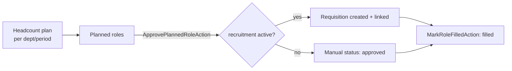

# Workforce Planning — Architecture

Intended service, action, and page design. Not yet built (see [[_module]]).

## Services & Actions

- `WorkforceService::planVsActual(string $period): Collection` — per-department target vs current active headcount.
- `ApprovePlannedRoleAction::run(string $roleId): void` — sets status `approved`; when `hr.recruitment` is active, creates a requisition and links it. Without recruitment, status is tracked manually.
- `MarkRoleFilledAction::run(string $roleId): void` — sets status `filled`.

## Custom Page

`WorkforcePlanningDashboard` is a #6 dashboard page ([[../../../architecture/patterns/custom-pages]]): planned-vs-actual charts plus a scenario toggle (best/expected/worst-case). Standard CRUD is handled by `HeadcountPlanResource` and `PlannedRoleResource`.

## Money

All monetary columns are integer minor units (`budgeted_cost_cents`, `budgeted_salary_cents`). Budget math goes through `brick/money`, never raw float arithmetic ([[../../../architecture/packages]]).

## Flow

## Related

- [[data-model]]
- [[api]]
- [[../../../architecture/patterns/custom-pages]]
- [[../../../architecture/packages]]
