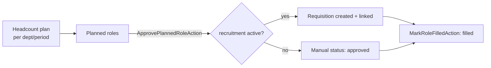

# Workforce Planning — Architecture

Intended service, action, and page design. Not yet built (see [[_module]]).

## Services & Actions

- `WorkforceService::planVsActual(string $period): Collection` — per-department target vs current active headcount.
- `ApprovePlannedRoleAction::run(string $roleId): void` — sets status `approved`; when `hr.recruitment` is active, creates a requisition and links it. Without recruitment, status is tracked manually.
- `MarkRoleFilledAction::run(string $roleId): void` — sets status `filled`.

## Filament Artifacts

**Nav group:** Analytics

| Artifact | Kind ([[../../../architecture/ui-strategy]] row) | Blueprint / Tweaks | Notes |
|---|---|---|---|
| `HeadcountPlanResource` | #1 CRUD resource | — | target headcount per department per period |
| `PlannedRoleResource` | #1 CRUD resource | tweaks: state-badge-column (draft/approved/filled), custom-header-actions (approve-role / mark-filled) | approve creates + links a recruitment requisition when `hr.recruitment` is active |
| `WorkforcePlanningDashboard` | #6 Dashboard custom page | [[../../../architecture/patterns/page-blueprints#Dashboard]] | planned-vs-actual charts + scenario toggle (best/expected/worst-case); widget polling 30–60s |

**Access contract (mandatory):** every artifact gates on
`canAccess() = Auth::user()->can('hr.workforce.view-any') && BillingService::hasModule('hr.workforce')`
per [[../../../architecture/filament-patterns]] #1. `WorkforcePlanningDashboard` is a custom page and MUST state this explicitly — Filament does not auto-gate custom pages. Approve-role requires `hr.workforce.approve-role`, mark-filled `hr.workforce.mark-filled` *(assumed)*. The budget-vs-actual column is hidden when `finance.budgets` is unbuilt. Public/portal surfaces use a guest or scoped-portal guard (Vue+Inertia per [[../../../architecture/ui-strategy]]).

## Custom Page

`WorkforcePlanningDashboard` is a #6 dashboard page ([[../../../architecture/patterns/custom-pages]]): planned-vs-actual charts plus a scenario toggle (best/expected/worst-case). Standard CRUD is handled by `HeadcountPlanResource` and `PlannedRoleResource`.

## Money

All monetary columns are integer minor units (`budgeted_cost_cents`, `budgeted_salary_cents`). Budget math goes through `brick/money`, never raw float arithmetic ([[../../../architecture/packages]]).

## Concurrency

| Write path | Tier | Mechanism |
|---|---|---|
| Headcount plan CRUD (form, API) | Optimistic | `updated_at` stale-check on save → `StaleRecordException` → conflict notification ([[../../../architecture/patterns/optimistic-locking]]) |
| Planned role CRUD | Optimistic | `updated_at` stale-check ([[../../../architecture/patterns/optimistic-locking]]) |
| Planned role transition (`ApprovePlannedRoleAction` / `MarkRoleFilledAction`) | Pessimistic | `DB::transaction()` + `lockForUpdate()` on the role — prevents a double-approve creating two requisitions; per [[../../../architecture/patterns/states]] |
| Plan-vs-actual (`planVsActual`) | n/a | read-only derived aggregate — no write path |

Tiers per [[../../../decisions/decision-2026-07-02-optimistic-locking-standard]].

## Flow

## Related

- [[data-model]]
- [[api]]
- [[../../../architecture/patterns/custom-pages]]
- [[../../../architecture/packages]]
