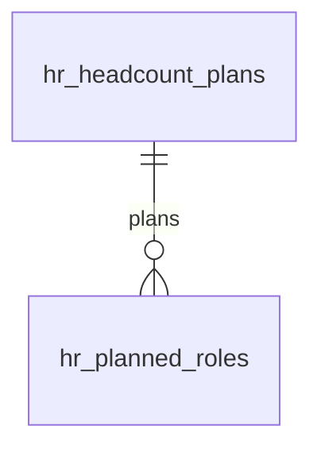

# Workforce Planning — Data Model

Two tenant-scoped tables. Intended schema; migrations not yet written (see [[_module]] Build Manifest). Persistence conventions per [[../../../infrastructure/database]].

## hr_headcount_plans

| Column | Type | Notes |
|---|---|---|
| id, company_id (indexed) | ulid | |
| department_id | ulid nullable FK | null = company-wide |
| period | string | e.g. `2026-Q3` / `2027`; unique `(company_id, department_id, period)` |
| target_headcount | int | min 0 |
| expected_attrition | int default 0 | *(assumed)* |
| budgeted_cost_cents | bigint | integer minor units |
| currency | string(3) | |
| deleted_at | timestamp nullable | soft delete |

## hr_planned_roles

| Column | Type | Notes |
|---|---|---|
| id, plan_id FK, company_id (indexed) | ulid | |
| title | string | |
| target_start_date | date | |
| budgeted_salary_cents | bigint | integer minor units |
| status | string default `planned` | planned / approved / filled |
| requisition_id | ulid nullable | link when recruitment active |

## ERD

## Related

- [[architecture]]
- [[../../../infrastructure/database]]
- [[../../../security/tenancy-isolation]]
