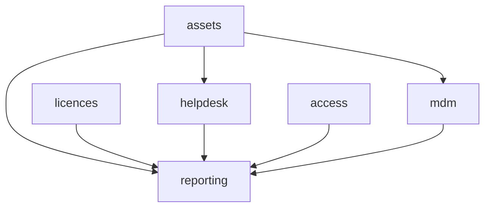

# IT & Security

Asset inventory, IT helpdesk, access provisioning, software licences, MDM integration, and reporting. **Panel:** `/it` (Cyan) — Phase 3.

---

## Navigation Groups

- **Assets** — Asset Inventory, Assignments
- **Helpdesk** — IT Tickets, Queue
- **Access** — Systems, Access Grants, Access Review
- **Licences** — Software Licences
- **Devices** — MDM Devices
- **Reporting** — IT Dashboard

---

## Modules

| Module | Key | Status | Priority | Depends on (intra-domain) |
|---|---|---|---|---|
| [[domains/it/asset-inventory\|Asset Inventory]] | `it.assets` | planned | p3 | — (anchor) |
| [[domains/it/helpdesk\|IT Helpdesk]] | `it.helpdesk` | planned | p3 | assets (soft) |
| [[domains/it/access-provisioning\|Access Provisioning]] | `it.access` | planned | p3 | — |
| [[domains/it/software-licences\|Software Licences]] | `it.licences` | planned | p3 | — |
| [[domains/it/mdm-integration\|MDM Integration]] | `it.mdm` | planned | p3 | assets |
| [[domains/it/it-reporting\|IT Reporting]] | `it.reporting` | planned | p3 | assets |

## Dependency Graph (intra-domain)



## Cross-Domain Edges

| Direction | Event | Counterpart |
|---|---|---|
| Consumes | `EmployeeHired` (hr.profiles) | it.access provisioning checklist |
| Consumes | `EmployeeOffboarded` (hr.profiles) | it.access de-provision, it.assets return flags, it.licences seat reclaim |

Payload contracts: [[architecture/event-bus]].

---

## Status Board (Dataview)

```dataview
TABLE module-key AS "Key", status AS "Status", priority AS "Priority"
FROM "domains/it"
WHERE type = "module"
SORT module-key ASC
```

---

## Key Patterns

- `spatie/laravel-model-states` — asset status, ticket status
- Encrypted MDM API credentials ([[architecture/patterns/encryption]])
- Three offboarding listeners — the domain's main event surface
- Integrates with [[domains/hr/onboarding]] and [[domains/finance/fixed-assets]]
