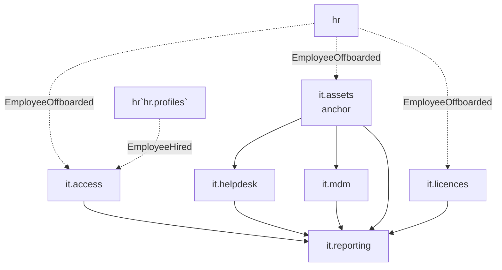

# IT & Security

Asset inventory, IT helpdesk, HR-driven access provisioning, software licences, MDM device management, and IT reporting. **Panel:** `/it` (Cyan) — Phase 3.

> [!info] Fully mapped to feature level
> All six modules are exploded into folder specs (`<slug>/_module.md` + `architecture` / `data-model` / `security` / `decisions` / `unknowns` / `features/*`) per [[decisions/decision-2026-06-20-full-mapping-conventions]]. Every feature carries a `## UI` + `## Data` + `## Relations` block; data-ownership boundaries follow [[security/data-ownership]]. Status is uniform `planned` (Phase 3).

**Displaces**: Snipe-IT / AssetSonar (assets), Jira Service Management / Freshservice (helpdesk), BetterCloud / Zluri (SaaS licences), Jamf / Intune (MDM), and the manual HR↔IT provisioning handoff that no single-purpose tool owns.

---

## Navigation Groups

- **Assets** — Asset Inventory, Assignments
- **Helpdesk** — IT Tickets, Staff Queue
- **Access** — Systems, Access Grants, Templates, Access Review
- **Licences** — Software Licences, Seats
- **Devices** — MDM Devices, Provider Config
- **Reporting** — IT Dashboard

---

## Modules

| Module | Key | Priority | Build status | Depends on (intra-domain) | Kind highlights |
|---|---|---|---|---|---|
| [[domains/it/asset-inventory/_module\|Asset Inventory]] | `it.assets` | p3 | planned | — (anchor) | resource |
| [[domains/it/helpdesk/_module\|IT Helpdesk]] | `it.helpdesk` | p3 | planned | assets (soft) | resource + #8 page |
| [[domains/it/access-provisioning/_module\|Access Provisioning]] | `it.access` | p3 | planned | — | 3 resources + #18 page |
| [[domains/it/software-licences/_module\|Software Licences]] | `it.licences` | p3 | planned | — | resource |
| [[domains/it/mdm-integration/_module\|MDM Integration]] | `it.mdm` | p3 | planned | assets | resource + #7 page |
| [[domains/it/it-reporting/_module\|IT Reporting]] | `it.reporting` | p3 | planned | assets + all IT (soft) | #6 page |

Asset Inventory is the IT anchor — build first. IT Reporting aggregates read-only from every other IT module and owns no tables.

## Dependency Graph (intra-domain)



Reporting's inbound edges are soft — its sections hide when a source module is inactive. Helpdesk's asset link is soft — it degrades to plain tickets without `it.assets`.

## Cross-Domain Edges

The IT domain's main event surface is the **HR employee lifecycle**. Each consumer reacts with its **own** listener writing its **own** tables (never HR's) — [[security/data-ownership]].

| Direction | Event | Source | IT consumer → effect (own tables) |
|---|---|---|---|
| Consumes | `EmployeeHired` | hr.profiles | `it.access` → `ProvisionOnHireListener` creates pending grants from role template (`it_access_grants`) |
| Consumes | `EmployeeOffboarded` | hr.profiles | `it.access` → flag active grants for revocation (`it_access_grants`) |
| Consumes | `EmployeeOffboarded` | hr.profiles | `it.assets` → `FlagAssetsForReturnListener` flags assigned assets (`it_assets`) |
| Consumes | `EmployeeOffboarded` | hr.profiles | `it.licences` → `FlagSeatsForReclaimListener` flags seats (`it_licence_assignments`) |
| Reads | employee records | hr.profiles | assignees / requesters / grant holders (read-only) |
| Soft feed | licence spend | it.licences | finance.expenses — read-only report link |
| Soft link | financial asset | finance.assets | `it_assets.fin_asset_id` — read-only reference |

Payload contracts: [[architecture/event-bus]]. Ownership rule: [[security/data-ownership]].

---

## Status Board (Dataview)

```dataview
TABLE module AS "Module", build-status AS "Build", status AS "Status"
FROM "domains/it"
WHERE type = "module"
SORT module ASC
```

---

## Key Patterns

- `spatie/laravel-model-states` — asset lifecycle, ticket status
- Encrypted MDM API credentials ([[architecture/patterns/encryption]] — `it_mdm_config.api_key`)
- Three HR-offboarding listeners (assets return, licence seat reclaim, access de-provision) + one HR-hire listener (access provision) — the domain's core cross-domain surface
- `brick/money` for licence spend + waste; caching for IT Reporting aggregates
- Integrates with [[domains/hr/onboarding/_module]] and [[domains/finance/fixed-assets/_module]]

## Related

- [[domains/it/asset-inventory/_module]] · [[domains/it/helpdesk/_module]] · [[domains/it/access-provisioning/_module]] · [[domains/it/software-licences/_module]] · [[domains/it/mdm-integration/_module]] · [[domains/it/it-reporting/_module]]
- [[domains/it/_opportunities|IT Opportunity Radar]]
- [[decisions/decision-2026-06-20-full-mapping-conventions]] · [[security/data-ownership]] · [[architecture/event-bus]]
