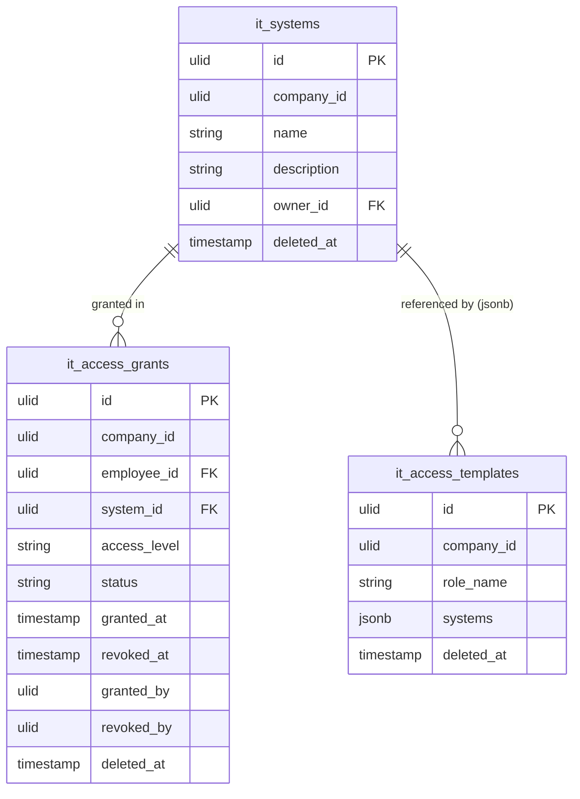

# Access Provisioning — Data Model

Tables owned: `it_systems`, `it_access_grants`, `it_access_templates`. This module writes only these three
tables — employee reference data lives in hr.profiles and is read via events, never written
([[../../../security/data-ownership]]).

---

## it_systems

| Column | Type | Constraints | Notes |
|---|---|---|---|
| id, company_id (indexed) | ulid | | |
| name | string | not null | e.g. Google Workspace, Slack, GitHub |
| description | string | nullable | |
| owner_id | ulid | FK users, nullable | system owner |
| deleted_at | timestamp | nullable | soft delete |

---

## it_access_grants

| Column | Type | Constraints | Notes |
|---|---|---|---|
| id, company_id (indexed) | ulid | | |
| employee_id | ulid | FK (hr employee ref) | not written back to HR |
| system_id | ulid | FK it_systems | |
| access_level | string | in set | admin / user / read *(assumed set)* |
| status | string | default `pending` | pending / granted / revoke-flagged / revoked |
| granted_at | timestamp | nullable | stamped by `AccessService::grant` |
| revoked_at | timestamp | nullable | stamped by `AccessService::revoke` |
| granted_by | ulid | nullable | acting user |
| revoked_by | ulid | nullable | acting user |
| deleted_at | timestamp | nullable | soft delete |

Unique **active** `(employee_id, system_id)` — a partial/filtered unique index so an employee cannot hold
two live grants to the same system (revoked rows excluded) *(assumed: enforced via partial unique index on non-revoked rows)*.

---

## it_access_templates

| Column | Type | Constraints | Notes |
|---|---|---|---|
| id, company_id (indexed) | ulid | | |
| role_name | string | not null | matched against the hired employee's job role |
| systems | jsonb | not null | `[{ system_id, access_level }]` |
| deleted_at | timestamp | nullable | soft delete |

---

## ERD

---

## DTOs

### GrantAccessData
- `employee_id` — ulid in company; must have no active grant for the system
- `system_id` — ulid in company (`it_systems`)
- `access_level` — required, in the access-level set (admin / user / read)

### CreateTemplateData
- `role_name` — required, matched against hired employees' job role
- `systems` — array of `{ system_id, access_level }`; each `system_id` must be an existing `it_systems` id in the company
