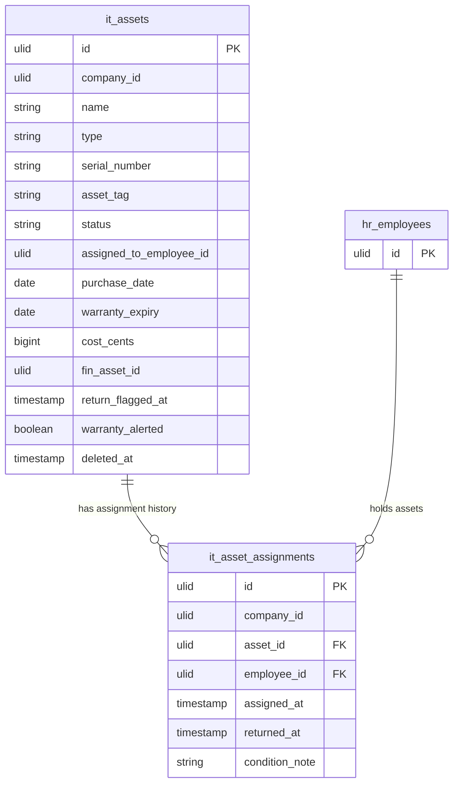

# Asset Inventory — Data Model

Tables owned: `it_assets`, `it_asset_assignments`.

---

## it_assets

| Column | Type | Constraints | Notes |
|---|---|---|---|
| id, company_id (indexed) | ulid | | |
| name | string | not null | |
| type | string | in set | laptop, desktop, phone, monitor, peripheral |
| serial_number | string | nullable | unique per company where set |
| asset_tag | string | not null | unique per company |
| status | string | default `in_stock` | state machine |
| assigned_to_employee_id | ulid | nullable | current holder |
| purchase_date | date | nullable | |
| warranty_expiry | date | nullable | drives expiry alerts |
| cost_cents | bigint | nullable | minor currency unit (brick/money) |
| fin_asset_id | ulid | nullable | finance.assets link |
| return_flagged_at | timestamp | nullable | set on offboarding |
| warranty_alerted | boolean | default false | once-guard for warranty alert |
| deleted_at | timestamp | nullable | soft delete |

---

## it_asset_assignments

| Column | Type | Constraints | Notes |
|---|---|---|---|
| id, company_id (indexed) | ulid | | |
| asset_id | ulid | FK it_assets | the assigned asset |
| employee_id | ulid | FK (hr employee) | assignee |
| assigned_at | timestamp | not null | |
| returned_at | timestamp | nullable | open row = current assignment |
| condition_note | string | nullable | captured on return |

---

## ERD

`hr_employees` shown for context only — owned by hr.profiles, referenced via `employee_id` / `assigned_to_employee_id`, never written from this module.

---

## DTOs

### CreateAssetData
- `name` — required
- `type` — required, in set (laptop, desktop, phone, monitor, peripheral)
- `asset_tag` — required, unique per company
- `serial_number?` — unique per company where set
- `purchase_date?`
- `warranty_expiry?`
- `cost_cents?` — minor currency unit

### AssignAssetData
- `asset_id` — ulid in company, status `in_stock`
- `employee_id` — ulid in company, active employee

### ReturnAssetData
- `asset_id` — ulid in company, status `assigned`
- `condition_note?`
