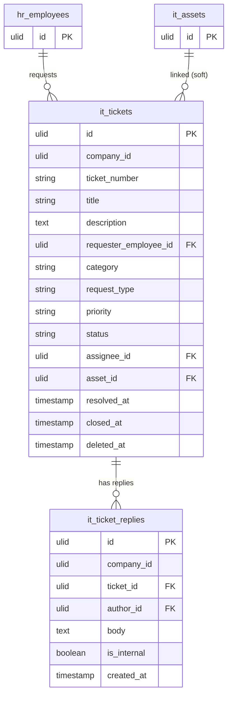

# IT Helpdesk — Data Model

Tables owned: `it_tickets`, `it_ticket_replies`.

---

## it_tickets

| Column | Type | Constraints | Notes |
|---|---|---|---|
| id, company_id (indexed) | ulid | | |
| ticket_number | string | unique per company | sequential per company |
| title | string | not null | |
| description | text | not null | |
| requester_employee_id | ulid | FK hr_employees | the reporting employee |
| category | string | in set | hardware / software / access / network / account |
| request_type | string | in set | incident / service-request |
| priority | string | in set | urgent / high / normal / low |
| status | string | default `open` | state machine (open/in_progress/resolved/closed) |
| assignee_id | ulid | nullable, FK users | IT staff member |
| asset_id | ulid | nullable | soft link to `it_assets` (read/FK only) |
| resolved_at | timestamp | nullable | stamped on resolve |
| closed_at | timestamp | nullable | stamped on close (manual or auto-close 3d) |
| deleted_at | timestamp | nullable | soft delete |

**Indexes:** `(company_id, status, priority)`, `(company_id, assignee_id, status)`

---

## it_ticket_replies

| Column | Type | Constraints | Notes |
|---|---|---|---|
| id, company_id (indexed) | ulid | | |
| ticket_id | ulid | FK it_tickets, cascade | parent ticket |
| author_id | ulid | FK users | who wrote the reply |
| body | text | not null | reply content |
| is_internal | boolean | default false | internal IT note — invisible to requester, no notification |
| created_at | timestamp | | |

---

## ERD

---

## DTOs

### CreateItTicketData
- `title` — required
- `description` — required
- `category` — required, in set (hardware / software / access / network / account)
- `request_type` — required, in set (incident / service-request)
- `priority` — default `normal`, in set (urgent / high / normal / low)
- `asset_id?` — nullable; for requesters restricted to their own assigned asset *(assumed)*

### ItReplyData
- `ticket_id` — ulid in company
- `body` — required
- `is_internal` — boolean (only IT staff may set true *(assumed)*)
