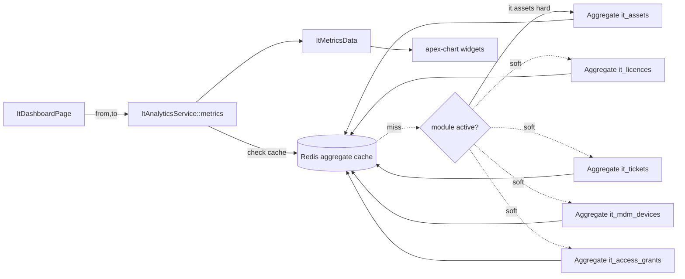

# IT Reporting — Architecture

Read-only analytics layer over the IT domain. No tables of its own; all data sourced read-only from `it_assets`, `it_licences`, `it_tickets`, `it_mdm_devices`, `it_access_grants`. Pattern: [[../../../architecture/patterns/custom-pages]]. See also [[../../../architecture/filament-patterns]], [[../../../architecture/caching]], [[../../../architecture/ui-strategy]].

---

## Services & Actions

- `ItAnalyticsService::metrics(CarbonImmutable $from, CarbonImmutable $to): ItMetricsData` — single service, all aggregate queries, intended to be N+1-free (one grouped query per source table, not per-row).

Behavior:

- **Soft-dep sections null when inactive** — when `it.licences` / `it.helpdesk` / `it.mdm` / `it.access` is not active for the company, the corresponding section of the returned `ItMetricsData` is `null`. The service checks `BillingService::hasModule(...)` before running that section's query; no query runs and no error is raised for an inactive module.
- **brick/money** — all monetary aggregates (asset inventory value, licence monthly/annual spend, waste) are computed with `brick/money` for rounding consistency; amounts are stored/passed as integer minor units.
- **No N+1** — each source table is aggregated with a single grouped query; the service never iterates models to sum.

Output DTO `ItMetricsData` carries: asset value/count breakdowns, licence spend + utilisation + waste, helpdesk volume/resolution series, compliance rate, and upcoming renewal/warranty items. Soft-dep sections are `?nullable`.

---

## Caching

Redis caching of computed aggregates — dashboard staleness is acceptable, so **TTL-only invalidation** (no event-driven busting). See [[../../../architecture/caching]].

| Key | TTL | Invalidated by |
|---|---|---|
| `company:{id}:it:metrics:{from}:{to}` | 1 h (historical range) / 15 min (current period) | TTL only |

The key embeds `company_id` (tenant isolation) and the `{from}`/`{to}` window so each date range caches independently.

---

## Flow

---

## Filament Artifacts

**Nav group:** Reporting

| Artifact | Kind ([[../../../architecture/ui-strategy]] row) | Notes |
|---|---|---|
| `ItDashboardPage` | #6 dashboard custom page + apex charts | period filter in header; soft-dep sections conditional; export action (throttled) |

Widgets (built on `leandrocfe/filament-apex-charts`), hosted on the dashboard:

| Widget | Reads | Renders |
|---|---|---|
| `AssetValueWidget` | `it_assets` (hard) | inventory value + count by type/status |
| `LicenceSpendWidget` | `it_licences` (soft) | monthly/annual spend, utilisation, waste — hidden when inactive |
| `HelpdeskWidget` | `it_tickets` (soft) | ticket volume, resolution time, by category — hidden when inactive |
| `ComplianceWidget` | `it_mdm_devices` (soft) | device compliance rate — hidden when inactive |

Soft-dep widgets render only when their module is active (`BillingService::hasModule(...)`); an inactive module simply omits its widget from the grid.

Pattern reference: [[../../../architecture/patterns/custom-pages]], [[../../../architecture/ui-strategy]].

---

## Concurrency

| Write path | Tier | Mechanism |
|---|---|---|
| All read paths (dashboard, widgets, export) | n-a | Read-only analytics over other modules' tables; no writes |
| Redis aggregate cache writes | n-a | TTL-keyed cache set; last-write-wins is safe (idempotent recompute) |

Tiers per [[../../../decisions/decision-2026-07-02-optimistic-locking-standard]].

---

## Jobs & Scheduling

None. Metrics compute synchronously per request behind the TTL cache; export is a synchronous (throttled) download action.
