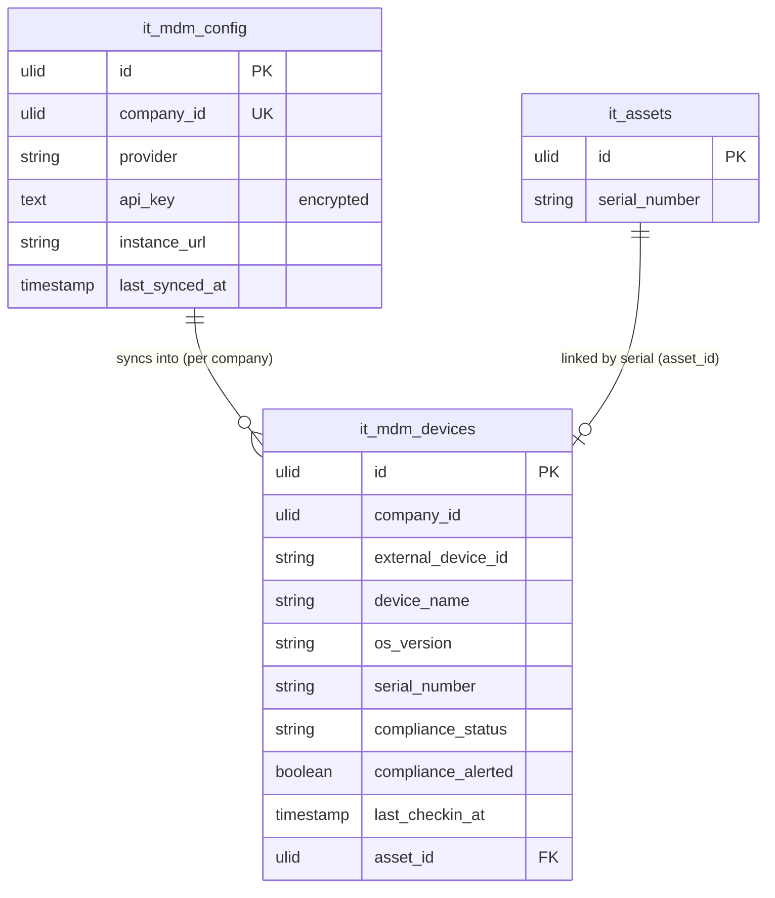

# MDM Integration — Data Model

Tables owned: `it_mdm_config`, `it_mdm_devices`.

---

## it_mdm_config

One row per company holding the provider connection.

| Column | Type | Constraints | Notes |
|---|---|---|---|
| id | ulid | PK | |
| company_id | ulid | indexed, **unique** | one MDM config per company |
| provider | string | in set (jamf / intune / kandji) | resolves the active driver |
| api_key | text | **🔐 encrypted** | encrypted cast; write-only, never re-displayed — [[security\|mdm.security]] |
| instance_url | string | nullable *(assumed)* | provider tenant / instance base URL |
| last_synced_at | timestamp | nullable | sync cursor for incremental pulls |

---

## it_mdm_devices

One row per managed device pulled from the provider.

| Column | Type | Constraints | Notes |
|---|---|---|---|
| id | ulid | PK | |
| company_id | ulid | indexed | |
| external_device_id | string | **unique `(company_id, external_device_id)`** | provider's device id — sync dedupe / upsert key |
| device_name | string | not null | |
| os_version | string | not null | |
| serial_number | string | nullable | auto-match key against `it_assets` |
| compliance_status | string | not null | compliant / non-compliant / unknown |
| compliance_alerted | boolean | default false | true once IT notified; reset on state change |
| last_checkin_at | timestamp | nullable | device's last provider check-in |
| asset_id | ulid | nullable, FK `it_assets` | set by serial auto-match (read-linked, not owned) |

---

## ERD

---

## DTOs

### ConnectMdmData
- `provider` — required, in set (jamf / intune / kandji)
- `api_key` — required, write-only; **verified against the provider before save** then stored 🔐 encrypted
- `instance_url` — provider instance base URL *(assumed)*

### DeviceActionData
- `device_id` — ulid in company
- `action` — required, in set (lock / wipe)
- `wipe` is permission-gated (`it.mdm.wipe`) + confirmed + audited — see [[security|mdm.security]]
