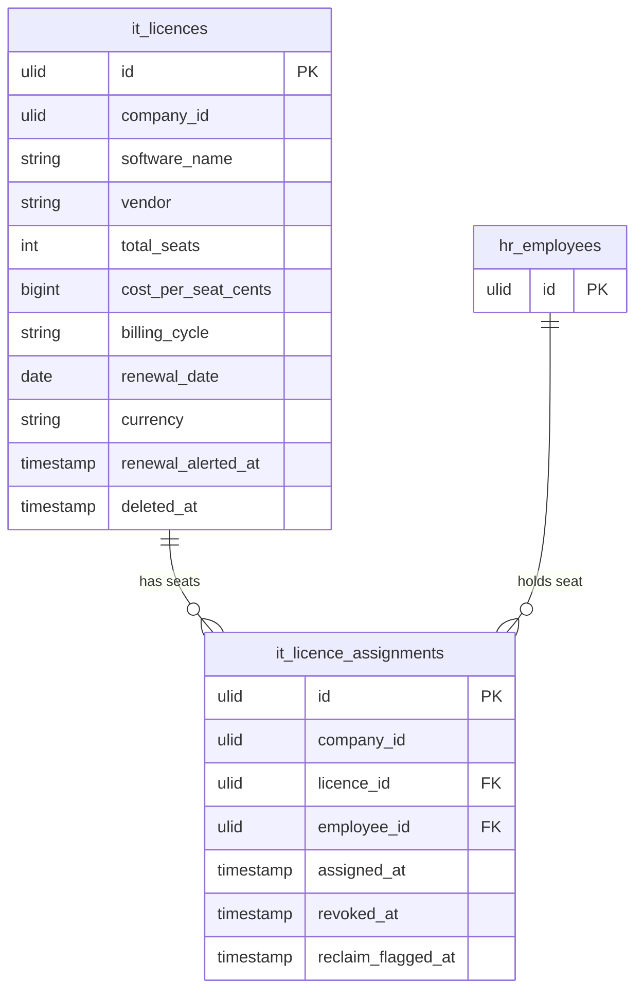

# Software Licences — Data Model

Tables owned: `it_licences`, `it_licence_assignments`.

---

## it_licences

| Column | Type | Constraints | Notes |
|---|---|---|---|
| id, company_id (indexed) | ulid | | |
| software_name | string | not null | |
| vendor | string | not null | |
| total_seats | int | min 1 | |
| cost_per_seat_cents | bigint | min 0 | minor currency unit; brick/money for arithmetic |
| billing_cycle | string | in (monthly, annual) | |
| renewal_date | date | not null | |
| currency | string(3) | not null | ISO 4217 |
| renewal_alerted_at | timestamp | nullable | per-cycle once-guard; cleared on `renewal_date` change |
| deleted_at | timestamp | nullable | soft delete |

---

## it_licence_assignments

| Column | Type | Constraints | Notes |
|---|---|---|---|
| id, company_id (indexed) | ulid | | |
| licence_id | ulid | FK it_licences, cascade | |
| employee_id | ulid | FK hr_employees | seat holder |
| assigned_at | timestamp | not null | |
| revoked_at | timestamp | nullable | set on `RevokeSeatAction`; null = active seat |
| reclaim_flagged_at | timestamp | nullable | set by `FlagSeatsForReclaimListener` on offboard |

**Unique active seat:** unique `(licence_id, employee_id)` where `revoked_at IS NULL` — one active seat per employee per licence (duplicate active seat rejected).

---

## ERD

---

## DTOs

### CreateLicenceData
- `software_name` — required
- `vendor` — required
- `total_seats` — int, min:1
- `cost_per_seat_cents` — int, min:0
- `billing_cycle` — required, in (monthly, annual)
- `renewal_date` — date
- `currency` — string(3), ISO 4217

### AssignSeatData
- `licence_id` — ulid in company; must have a free seat ("All seats are in use.")
- `employee_id` — ulid in company; must have no active seat on this licence
