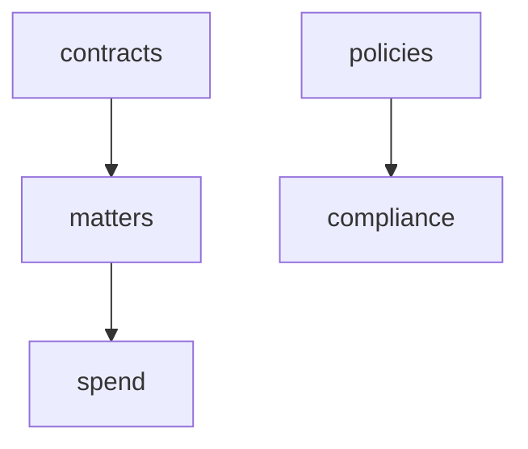

# Legal & Compliance

Contract management, compliance registers, matter management, legal spend, policy library, and DSAR processing. **Panel:** `/legal` (Amber) — Phase 3.

---

## Navigation Groups

- **Contracts** — Legal Contracts
- **Matters** — Matter Management
- **Spend** — Legal Expenses, Budgets
- **Compliance** — Frameworks, Controls, Policies, DSAR Requests

---

## Modules

| Module | Key | Status | Priority | Depends on (intra-domain) |
|---|---|---|---|---|
| [[domains/legal/legal-contracts\|Legal Contracts]] | `legal.contracts` | planned | p3 | — (anchor) |
| [[domains/legal/matter-management\|Matter Management]] | `legal.matters` | planned | p3 | — |
| [[domains/legal/legal-spend\|Legal Spend]] | `legal.spend` | planned | p3 | matters |
| [[domains/legal/policy-library\|Policy Library]] | `legal.policies` | planned | p3 | — |
| [[domains/legal/compliance-registers\|Compliance Registers]] | `legal.compliance` | planned | p3 | policies (soft) |
| [[domains/legal/dsar-processing\|DSAR Processing]] | `legal.dsar` | planned | p3 | — (core.privacy layer) |

## Dependency Graph (intra-domain)



## Cross-Domain Edges

| Direction | Event | Counterpart |
|---|---|---|
| Consumes | `DSARRequestSubmitted` (core.privacy) | legal.dsar review workflow |

DSAR erasure/export engine stays in core.privacy (PersonalDataRegistry) — legal.dsar is the workflow layer; the v1-spec `DSARErasureRequested` event was dropped in v2.

---

## Status Board (Dataview)

```dataview
TABLE module-key AS "Key", status AS "Status", priority AS "Priority"
FROM "domains/legal"
WHERE type = "module"
SORT module-key ASC
```

---

## Key Patterns

- `spatie/laravel-model-states` — contract status, matter status
- `awcodes/filament-tiptap-editor` — policies (purified)
- Confidential matters: second-layer access list on top of CompanyScope
- Legal spend → Finance AP via manual bill link (v1)
- Append-only DSAR action log as compliance proof ([[architecture/data-lifecycle]])
