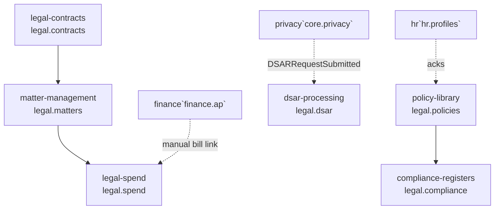

# Legal & Compliance — MOC

Contract management, matter management, legal spend, policy library, compliance registers, and DSAR processing. **Panel:** `/legal` (Amber) — Phase 3.

**Displaces**: Ironclad / LinkSquares / ContractWorks (contracts), LawVu (matters + spend), DocuSign CLM (lifecycle), OneTrust (DSAR workflow).

Every module is a folder spec (`<slug>/_module.md` + architecture / data-model / api / security / decisions / unknowns / features). Constitution: [[../../decisions/decision-2026-06-20-full-mapping-conventions]].

---

## Module map



---

## Modules

| Module | Key | Priority | Build status | Kind highlights | Depends on (intra-domain) |
|---|---|---|---|---|---|
| [[legal-contracts/_module\|Legal Contracts]] | `legal.contracts` | p3 | planned | resource + lifecycle queue custom-page + renewal widget | — (anchor) |
| [[matter-management/_module\|Matter Management]] | `legal.matters` | p3 | planned | resource + matter timeline (detail tabs) | — |
| [[legal-spend/_module\|Legal Spend]] | `legal.spend` | p3 | planned | resource + approval queue + spend dashboard | matters |
| [[policy-library/_module\|Policy Library]] | `legal.policies` | p3 | planned | resource + ack matrix (heat-map) + self-service gallery | — |
| [[compliance-registers/_module\|Compliance Registers]] | `legal.compliance` | p3 | planned | resources + readiness dashboard | policies (soft) |
| [[dsar-processing/_module\|DSAR Processing]] | `legal.dsar` | p3 | planned | fulfilment wizard + extended DSAR resource (timeline) | — (core.privacy layer) |

Build order: contracts → matters → spend; policies → compliance; dsar (independent, core.privacy layer).

---

## Navigation Groups

- **Contracts** — Legal Contracts
- **Matters** — Matter Management
- **Spend** — Legal Expenses, Budgets
- **Compliance** — Frameworks, Controls, Policies, DSAR Requests

---

## Cross-Domain Edges

| Direction | Event / API | Counterpart | Module |
|---|---|---|---|
| Consumes | `DSARRequestSubmitted` | core.privacy | legal.dsar (review + verify + delegate) |
| Reads | PersonalDataRegistry | core.privacy | legal.dsar discovery |
| Reads | employee/department API | hr.profiles | legal.policies acknowledgements |
| Reads | manual AP-bill link | finance.ap | legal.spend (`fin_bill_id` reference) |
| Reads | ContactService / SupplierService | crm.contacts, operations.suppliers | legal.contracts counterparty |

DSAR erasure/export engine stays in core.privacy (PersonalDataRegistry) — legal.dsar is the workflow layer; the v1-spec `DSARErasureRequested` event was dropped in v2. Data-ownership rule: [[../../security/data-ownership]].

---

## Status Board (Dataview)

```dataview
TABLE module AS "Module", build-status AS "Build", status AS "Status"
FROM "domains/legal"
WHERE type = "module"
SORT module ASC
```

---

## Key Patterns

- `spatie/laravel-model-states` — contract status, matter status
- `awcodes/filament-tiptap-editor` + `ezyang/htmlpurifier` — policies (purified)
- Confidential matters: second-layer access list on top of CompanyScope ([[matter-management/security]])
- Legal spend → Finance AP via manual bill link (v1)
- Append-only, encrypted DSAR action log as compliance proof ([[../../architecture/data-lifecycle]])

---

## Opportunity Radar

Market gaps + differentiators: [[_opportunities|Legal & Compliance — Opportunity Radar]].
