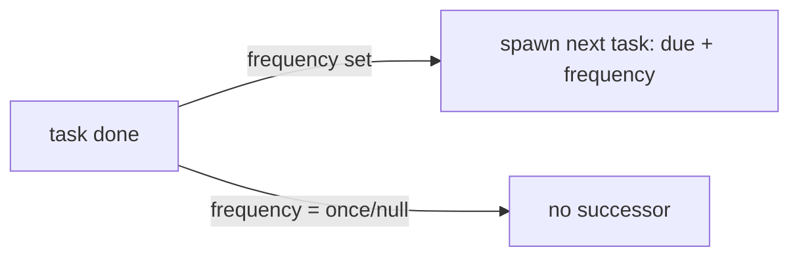

# Compliance Registers — Architecture

No state machine — control `status` is a plain enum; tasks are open/done with recurrence.

## Readiness math

`ComplianceService::readiness(frameworkId): float = compliant / (total − not-applicable)`. Not-applicable controls are excluded from both numerator and denominator.

## Task recurrence

## Services & Actions

- `ComplianceService::readiness(frameworkId): float`.
- `CompleteComplianceTaskAction` — on completion, if `frequency` set, spawns the next task (`due_date + frequency`), once.
- `ComplianceTaskReminderCommand` — daily, queue `notifications`; `reminded` once-guard, 7d/overdue windows.

## Jobs & Scheduling

| Job / Command | Queue | Schedule | Idempotency |
|---|---|---|---|
| `ComplianceTaskReminderCommand` | notifications | daily | `reminded` once-guard, 7d/overdue windows |

## Seeding

`GdprFrameworkSeeder` seeds a GDPR framework + control set on module activation *(assumed)*.

## Patterns

- `custom-pages` (readiness dashboard). Evidence files via `core.files` — see [[./security]].
