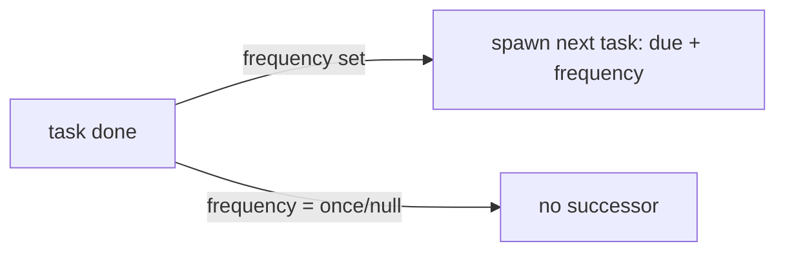

# Compliance Registers — Architecture

No state machine — control `status` is a plain enum; tasks are open/done with recurrence.

## Readiness math

`ComplianceService::readiness(frameworkId): float = compliant / (total − not-applicable)`. Not-applicable controls are excluded from both numerator and denominator.

## Task recurrence

## Services & Actions

- `ComplianceService::readiness(frameworkId): float`.
- `CompleteComplianceTaskAction` — on completion, if `frequency` set, spawns the next task (`due_date + frequency`), once.
- `ComplianceTaskReminderCommand` — daily, queue `notifications`; `reminded` once-guard, 7d/overdue windows.

## Jobs & Scheduling

| Job / Command | Queue | Schedule | Idempotency |
|---|---|---|---|
| `ComplianceTaskReminderCommand` | notifications | daily | `reminded` once-guard, 7d/overdue windows |

## Seeding

`GdprFrameworkSeeder` seeds a GDPR framework + control set on module activation *(assumed)*.

## Filament Artifacts

**Nav group:** Compliance

| Artifact | Kind ([[../../../architecture/ui-strategy]] row) | Blueprint / Tweaks | Notes |
|---|---|---|---|
| `FrameworkResource` | #1 CRUD resource | tweaks: view-page-tabs (Controls, Tasks, Readiness) | GDPR framework seeded read-only *(assumed)* |
| `ControlResource` | #1 CRUD resource | tweaks: state-badge-column (status enum), custom-header-actions (set status + evidence) | list filters: framework, status, owner |
| `ComplianceDashboardPage` | #6 Dashboard | [[../../../architecture/patterns/page-blueprints#Dashboard]] | readiness % per framework (blueprint-cell tiles), gap list table widget |

**Access contract (mandatory):** every artifact gates on
`canAccess() = Auth::user()->can('legal.compliance.view-any') && BillingService::hasModule('legal.compliance')`
per [[../../../architecture/filament-patterns]] #1. `ComplianceDashboardPage` is a custom page and MUST state this
explicitly — Filament does not auto-gate custom pages.

## Concurrency

| Write path | Tier | Mechanism |
|---|---|---|
| Framework / control / task CRUD | Optimistic | `updated_at` stale-check → `StaleRecordException` → conflict notification ([[../../../architecture/patterns/optimistic-locking]]) |
| Task completion (spawns next occurrence) | Pessimistic | `DB::transaction()` + `lockForUpdate()` on the task — successor spawned exactly once, second completer rejected |

Tiers per [[../../../decisions/decision-2026-07-02-optimistic-locking-standard]].

## Patterns

- `custom-pages` (readiness dashboard). Evidence files via `core.files` — see [[./security]].
