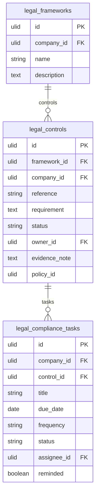

# Compliance Registers — Data Model

## legal_frameworks

| Column | Type | Notes |
|---|---|---|
| id, company_id (indexed) | ulid | |
| name | string | GDPR / ISO 27001 / SOC 2 / custom |
| description | text nullable | |
| deleted_at | timestamp nullable | |

---

## legal_controls

| Column | Type | Notes |
|---|---|---|
| id, framework_id FK, company_id (indexed) | ulid | |
| reference | string | e.g. `A.5.1`; unique `(framework_id, reference)` |
| requirement | text | |
| status | string default `non-compliant` | compliant / partial / non-compliant / not-applicable |
| owner_id | ulid nullable FK users | |
| evidence_note | text nullable | required for compliant/partial *(assumed)* |
| policy_id | ulid nullable | legal.policies link |
| deleted_at | timestamp nullable | |

---

## legal_compliance_tasks

| Column | Type | Notes |
|---|---|---|
| id, company_id (indexed), control_id FK | ulid | |
| title | string | |
| due_date | date | |
| frequency | string nullable | once / monthly / quarterly / annual |
| status | string | open / done |
| assignee_id | ulid FK users | |
| reminded | boolean default false | reminder once-guard |

---

## ERD

`policy_id` references `legal_policies` (owned by [[../policy-library/_module|legal.policies]]) — read-only.
