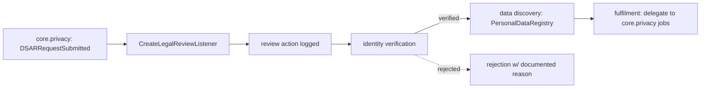

# DSAR Processing — Architecture

Workflow layer, not an engine. No local state machine — status lives on core.privacy's `dsar_requests`; this module records **actions** against it.

## Flow

## Services & Actions

- `LegalDsarService::verify(VerifyIdentityData)` — gate: when this module is active, core.privacy processing is blocked until the subject is verified *(hook)*.
- `LegalDsarService::discovery(requestId): array` — `PersonalDataRegistry` tables for the subject email (read-only).
- `RecordDsarActionAction` — append an action row.
- `CreateLegalReviewListener` on `DSARRequestSubmitted` — queued, `WithCompanyContext`; writes a review action only.

## Fulfilment = delegation

Export/erasure are **not** implemented here. Fulfilment triggers core.privacy's PersonalDataRegistry jobs; legal.dsar records `export-delivered` / `erasure-run` actions after the fact. No duplicate erasure logic.

## Filament Artifacts

**Nav group:** Privacy

| Artifact | Kind ([[../../../architecture/ui-strategy]] row) | Blueprint / Tweaks | Notes |
|---|---|---|---|
| `DsarFulfilmentPage` | #7 Wizard | [[../../../architecture/patterns/page-blueprints#Wizard]] — steps: Verify → Discover → Fulfil → Close *(assumed)* | works on core.privacy's `dsar_requests` (read) + own action log (append); rejection exits with documented reason |
| `DsarRequestResource` (extends core.privacy's) | #2 detail with tabs | tweaks: relation-manager-timeline (action trail), custom-header-actions (reject w/ required reason, record rectified) | deadline-sorted list from `dsar_requests`; per-request action timeline ([[./features/action-log-rejection]]) |

**Access contract (mandatory):** `DsarFulfilmentPage` gates on
`canAccess() = Auth::user()->can('legal.dsar.view-any') && BillingService::hasModule('legal.dsar')`
per [[../../../architecture/filament-patterns]] #1 — custom page, stated explicitly (no auto-gating). The DSAR list resource itself lives in core.privacy.

## Concurrency

| Write path | Tier | Mechanism |
|---|---|---|
| Action log (`legal_dsar_actions`) | n/a | Append-only rows — no in-place edits, nothing to stale-check |
| Verification gate flip | Pessimistic | `DB::transaction()` + `lockForUpdate()` on the request-scoped gate — verify recorded exactly once; second verifier sees the recorded action |

Tiers per [[../../../decisions/decision-2026-07-02-optimistic-locking-standard]]. The `dsar_requests` record is core.privacy's write surface — its concurrency is declared there.

## Patterns

- `gdpr` (data-lifecycle), `events` (consumes `DSARRequestSubmitted`). `notes` is `encrypted` cast (text column) — see [[./security]].
