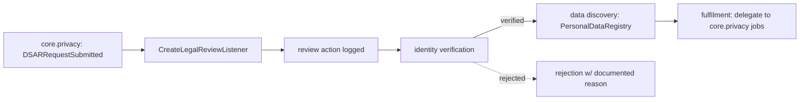

# DSAR Processing — Architecture

Workflow layer, not an engine. No local state machine — status lives on core.privacy's `dsar_requests`; this module records **actions** against it.

## Flow

## Services & Actions

- `LegalDsarService::verify(VerifyIdentityData)` — gate: when this module is active, core.privacy processing is blocked until the subject is verified *(hook)*.
- `LegalDsarService::discovery(requestId): array` — `PersonalDataRegistry` tables for the subject email (read-only).
- `RecordDsarActionAction` — append an action row.
- `CreateLegalReviewListener` on `DSARRequestSubmitted` — queued, `WithCompanyContext`; writes a review action only.

## Fulfilment = delegation

Export/erasure are **not** implemented here. Fulfilment triggers core.privacy's PersonalDataRegistry jobs; legal.dsar records `export-delivered` / `erasure-run` actions after the fact. No duplicate erasure logic.

## Patterns

- `gdpr` (data-lifecycle), `events` (consumes `DSARRequestSubmitted`). `notes` is `encrypted` cast (text column) — see [[./security]].
