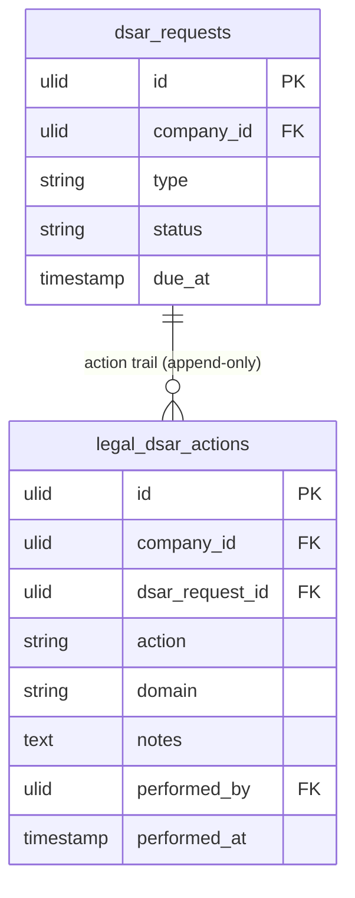

# DSAR Processing — Data Model

This module owns **one** table. The DSAR request itself (`dsar_requests`) is owned by [[../../core/data-privacy/_module|core.privacy]] — referenced by FK, never written here.

## legal_dsar_actions

| Column | Type | Notes |
|---|---|---|
| id, company_id (indexed) | ulid | |
| dsar_request_id | ulid FK dsar_requests | **core.privacy table** (read reference) |
| action | string | verified / discovery-run / export-delivered / erasure-run / rectified / rejected |
| domain | string nullable | per-domain steps |
| 🔐 notes | text nullable | **encrypted cast** — may reference data-subject PII; required for rejected/rectified |
| performed_by | ulid FK users | |
| performed_at | timestamp | |

Append-only — compliance proof, never purged ([[../../../architecture/data-lifecycle]]).

---

## ERD

`dsar_requests` shown for context only — **owned by core.privacy**, read-only here.
