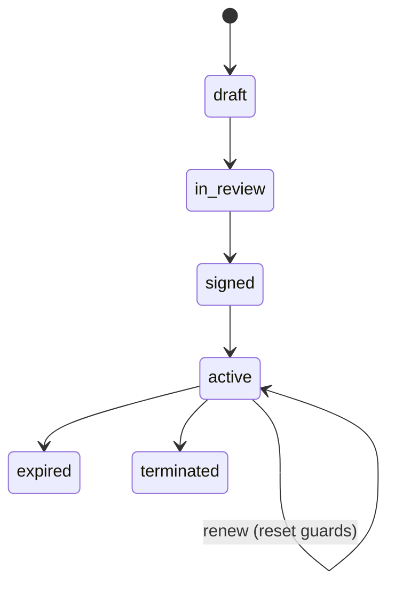

# Legal Contracts — Architecture

## State machine

`spatie/laravel-model-states` on `legal_contracts.status`.

| State | Transitions to | Triggered by | Side effects |
|---|---|---|---|
| `draft` | `in_review` | `legal.contracts.update` | |
| `in_review` | `signed` | signed-PDF upload + `legal.contracts.sign-off` | set `signed_at` |
| `signed` | `active` | start date (scheduled) or manual | |
| `active` | `expired` | end date passed, no renewal (scheduled) | |
| `active` | `terminated` | `legal.contracts.terminate` | reason required |
| `active` | renewed (stays `active`) | renew action | new dates, alert guards reset, audited |

## Services & Actions

- `LegalContractService::markSigned / renew / terminate` — owns all writes to `legal_contracts`.
- `LegalContractLifecycleCommand` — daily 05:45, queue `notifications`:
  - activates `signed` contracts on start date; expires `active` past end date (no renewal)
  - fires notice-deadline alerts (notice deadline = `renewal_date − notice_period_days`), 90/30d once each via `alerted_levels`
  - fires obligation overdue alerts via `legal_contract_obligations.alerted` once-guard

## Jobs & Scheduling

| Job / Command | Queue | Schedule | Idempotency |
|---|---|---|---|
| `LegalContractLifecycleCommand` | notifications | daily 05:45 | `alerted_levels` / obligation `alerted` guards |

## Filament Artifacts

**Nav group:** Contracts

| Artifact | Kind ([[../../../architecture/ui-strategy]] row) | Blueprint / Tweaks | Notes |
|---|---|---|---|
| `LegalContractResource` | #1 CRUD resource | tweaks: view-page-tabs, state-badge-column, custom-header-actions (sign-off / renew / terminate) | list filters: type, status, renewal window; obligations as a relation-manager tab ([[./features/obligation-tracking]]) |
| `ContractLifecyclePage` *(assumed)* | #3 custom page | [[../../../architecture/patterns/page-blueprints#Kanban]] — read-only queue grouped by urgency (overdue · ≤30d · ≤90d), no drag reorder | "Renewals & Lifecycle" at `/legal/contracts/lifecycle`; slide-over sign/renew/terminate ([[./features/contract-lifecycle]]) |
| `ContractRenewalWidget` | #6 dashboard widget | [[../../../architecture/patterns/page-blueprints#Dashboard]] | upcoming renewals/notice deadlines; polling 30–60s |

**Access contract (mandatory):** every artifact gates on
`canAccess() = Auth::user()->can('legal.contracts.view-any') && BillingService::hasModule('legal.contracts')`
per [[../../../architecture/filament-patterns]] #1. `ContractLifecyclePage` is a custom page and MUST state this
explicitly — Filament does not auto-gate custom pages. The roadmap external signer surface (`/sign/{token}`,
[[./features/e-signature]]) is Vue+Inertia per [[../../../architecture/ui-strategy]] with a scoped guest/portal guard
and a single-use signed token, not a Filament artifact.

## Concurrency

| Write path | Tier | Mechanism |
|---|---|---|
| Contract CRUD (form, API) | Optimistic | `updated_at` stale-check on save → `StaleRecordException` → conflict notification ([[../../../architecture/patterns/optimistic-locking]]) |
| Obligation CRUD (relation manager) | Optimistic | `updated_at` stale-check ([[../../../architecture/patterns/optimistic-locking]]) |
| Status transition (sign / renew / terminate / scheduled activate / expire) | Pessimistic | `DB::transaction()` + `lockForUpdate()`, re-read, validate, write per [[../../../architecture/patterns/states]] |

Tiers per [[../../../decisions/decision-2026-07-02-optimistic-locking-standard]].

## Patterns

- `states` (status machine), `money` (`value_cents` via brick/money).
- Signed PDF stored via `core.files` Media Library, `companies/{id}/` scoped, PDF-only whitelist — see [[./security]].
