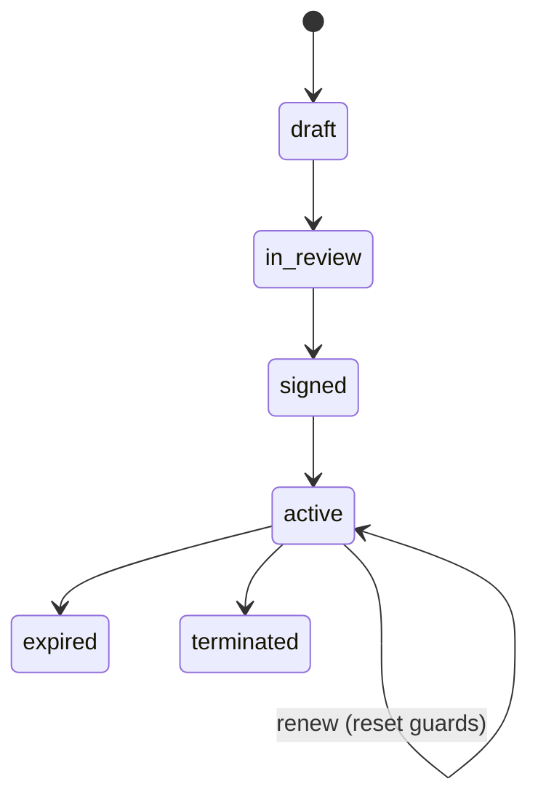

# Legal Contracts — Architecture

## State machine

`spatie/laravel-model-states` on `legal_contracts.status`.

| State | Transitions to | Triggered by | Side effects |
|---|---|---|---|
| `draft` | `in_review` | `legal.contracts.update` | |
| `in_review` | `signed` | signed-PDF upload + `legal.contracts.sign-off` | set `signed_at` |
| `signed` | `active` | start date (scheduled) or manual | |
| `active` | `expired` | end date passed, no renewal (scheduled) | |
| `active` | `terminated` | `legal.contracts.terminate` | reason required |
| `active` | renewed (stays `active`) | renew action | new dates, alert guards reset, audited |

## Services & Actions

- `LegalContractService::markSigned / renew / terminate` — owns all writes to `legal_contracts`.
- `LegalContractLifecycleCommand` — daily 05:45, queue `notifications`:
  - activates `signed` contracts on start date; expires `active` past end date (no renewal)
  - fires notice-deadline alerts (notice deadline = `renewal_date − notice_period_days`), 90/30d once each via `alerted_levels`
  - fires obligation overdue alerts via `legal_contract_obligations.alerted` once-guard

## Jobs & Scheduling

| Job / Command | Queue | Schedule | Idempotency |
|---|---|---|---|
| `LegalContractLifecycleCommand` | notifications | daily 05:45 | `alerted_levels` / obligation `alerted` guards |

## Patterns

- `states` (status machine), `money` (`value_cents` via brick/money).
- Signed PDF stored via `core.files` Media Library, `companies/{id}/` scoped, PDF-only whitelist — see [[./security]].
