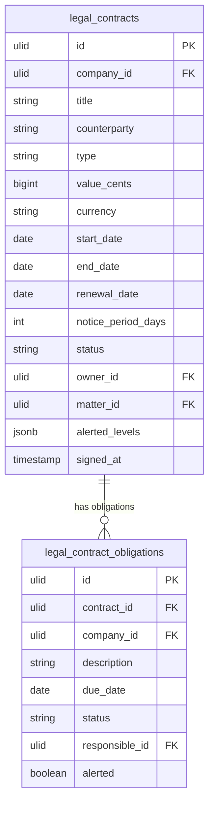

# Legal Contracts — Data Model

## legal_contracts

| Column | Type | Notes |
|---|---|---|
| id, company_id (indexed) | ulid | |
| title | string | |
| counterparty | string | + crm_account_id / ops_supplier_id nullable links |
| type | string | in set: NDA / MSA / vendor / employment / lease / partnership |
| value_cents | bigint nullable | brick/money |
| currency | string(3) | |
| start_date / end_date | date | end after start |
| renewal_date | date nullable | |
| notice_period_days | int default 30 | |
| status | string default `draft` | state machine |
| owner_id | ulid FK users | |
| matter_id | ulid nullable | legal.matters link |
| alerted_levels | jsonb default `[]` | 90/30 once-guards |
| signed_at | timestamp nullable | |
| deleted_at | timestamp nullable | |

**Indexes:** `(company_id, status, renewal_date)`, `(company_id, type)`

---

## legal_contract_obligations

| Column | Type | Notes |
|---|---|---|
| id, contract_id FK, company_id (indexed) | ulid | |
| description | string | deliverable / payment milestone |
| due_date | date | |
| status | string | open / done / overdue |
| responsible_id | ulid FK users | |
| alerted | boolean default false | overdue once-guard |

---

## ERD

