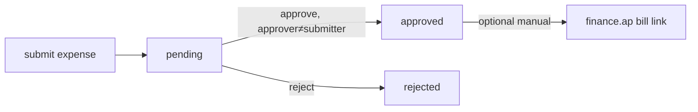

# Legal Spend — Architecture

No state machine — a lightweight `pending / approved / rejected` status on expenses.

## Approval flow

## Services & Actions

- `LegalSpendService::approve / reject` — approver must differ from submitter.
- `LegalSpendService::matterSpend(matterId): Money` — sums **approved only** (brick/money).
- `LegalSpendService::variance(?matterId, period): VarianceData` — approved actual vs `legal_budgets`, over-budget flag.
- Reads matters via `MatterService::accessibleFor` so spend inherits confidentiality.

## Patterns

- `money` (all amounts via brick/money), `custom-pages` (dashboard).
