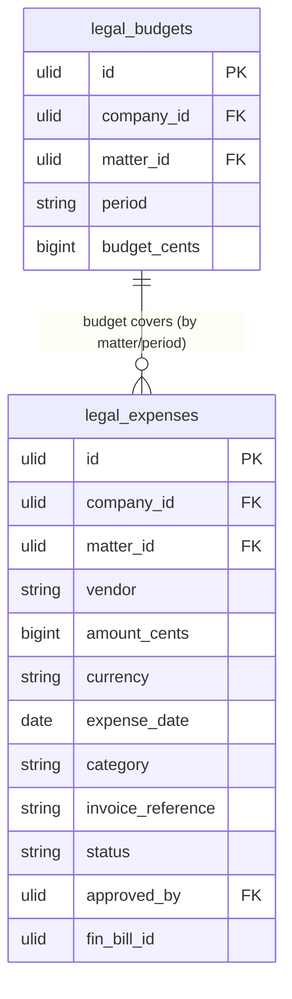

# Legal Spend — Data Model

## legal_expenses

| Column | Type | Notes |
|---|---|---|
| id, company_id (indexed), matter_id FK | ulid | |
| vendor | string | law firm |
| amount_cents | bigint > 0 | brick/money |
| currency | string(3) | |
| expense_date | date | ≤ today |
| category | string | counsel / court / filing / other *(assumed)* |
| invoice_reference | string nullable | unique `(company_id, vendor, invoice_reference)` |
| status | string default `pending` | pending / approved / rejected |
| approved_by | ulid nullable FK users | ≠ submitter |
| fin_bill_id | ulid nullable | finance.ap link (reference only) |
| deleted_at | timestamp nullable | |

**Indexes:** `(company_id, matter_id, status)`, `(company_id, vendor)`

---

## legal_budgets

| Column | Type | Notes |
|---|---|---|
| id, company_id (indexed) | ulid | |
| matter_id | ulid nullable | null = period budget |
| period | string | e.g. `2026-Q3` |
| budget_cents | bigint | |

Unique `(company_id, matter_id, period)`.

---

## ERD

`matter_id` references `legal_matters` (owned by [[../matter-management/_module|legal.matters]]) — read-only.
