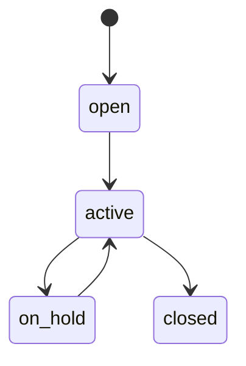

# Matter Management — Architecture

## State machine

`spatie/laravel-model-states` on `legal_matters.status`: `open → active → on_hold → closed`.

## Services & Actions

- `MatterService::accessibleFor(User $u): Builder` — single confidentiality API. Non-confidential matters visible per CompanyScope + permission; confidential matters visible only to owner + `access_list` users, **even for `view-any` holders**.
- `AddMatterEventAction` + status transition actions.
- `MatterDeadlineAlertCommand` — daily, queue `notifications`; alerts deadline events 7d out, once per event via `alerted`.

## Jobs & Scheduling

| Job / Command | Queue | Schedule | Idempotency |
|---|---|---|---|
| `MatterDeadlineAlertCommand` | notifications | daily | `alerted` once-guard, 7d window |

## Filament Artifacts

**Nav group:** Matters

| Artifact | Kind ([[../../../architecture/ui-strategy]] row) | Blueprint / Tweaks | Notes |
|---|---|---|---|
| `MatterResource` | #1 CRUD resource | tweaks: view-page-tabs, state-badge-column, custom-header-actions (close / change-status), relation-manager-timeline (matter events tab) | list filters: type, status, priority, confidential badge; confidentiality section (toggle + access-list multiselect) on form ([[./features/confidential-access]]); spend-summary panel when `legal.spend` active |

The matter timeline ([[./features/matter-timeline]]) is the `relation-manager-timeline` tweak on `MatterResource`
(vertical-timeline render of `legal_matter_events`), not a standalone page.

**Access contract (mandatory):** `MatterResource` gates on
`canAccess() = Auth::user()->can('legal.matters.view-any') && BillingService::hasModule('legal.matters')`
per [[../../../architecture/filament-patterns]] #1. **Row-level confidentiality is a second gate** on top of this:
every query flows through `MatterService::accessibleFor(User)`, which excludes confidential matters for anyone
who is not the owner or in `access_list` — **even `view-any` holders** ([[./security]]). `view-any` alone never
bypasses confidential scope.

## Concurrency

| Write path | Tier | Mechanism |
|---|---|---|
| Matter CRUD + confidentiality/access-list edit (form, API) | Optimistic | `updated_at` stale-check → `StaleRecordException` → conflict notification ([[../../../architecture/patterns/optimistic-locking]]) |
| Matter event / timeline CRUD | Optimistic | `updated_at` stale-check ([[../../../architecture/patterns/optimistic-locking]]) |
| Status transition (activate / on-hold / resume / close) | Pessimistic | `DB::transaction()` + `lockForUpdate()`, re-read, validate, write per [[../../../architecture/patterns/states]] |

Tiers per [[../../../decisions/decision-2026-07-02-optimistic-locking-standard]].

## Patterns

- `states` (matter status). Confidentiality is an app-layer second gate, not a Filament policy shortcut — enforced centrally in `accessibleFor`.
