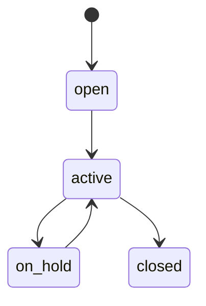

# Matter Management — Architecture

## State machine

`spatie/laravel-model-states` on `legal_matters.status`: `open → active → on_hold → closed`.

## Services & Actions

- `MatterService::accessibleFor(User $u): Builder` — single confidentiality API. Non-confidential matters visible per CompanyScope + permission; confidential matters visible only to owner + `access_list` users, **even for `view-any` holders**.
- `AddMatterEventAction` + status transition actions.
- `MatterDeadlineAlertCommand` — daily, queue `notifications`; alerts deadline events 7d out, once per event via `alerted`.

## Jobs & Scheduling

| Job / Command | Queue | Schedule | Idempotency |
|---|---|---|---|
| `MatterDeadlineAlertCommand` | notifications | daily | `alerted` once-guard, 7d window |

## Patterns

- `states` (matter status). Confidentiality is an app-layer second gate, not a Filament policy shortcut — enforced centrally in `accessibleFor`.
