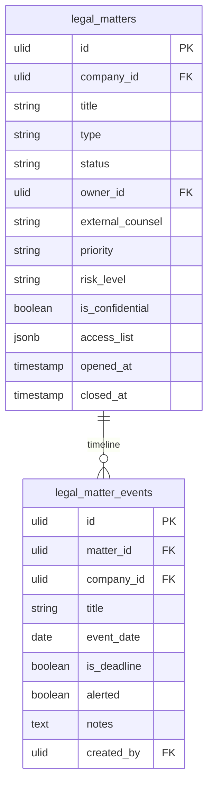

# Matter Management — Data Model

## legal_matters

| Column | Type | Notes |
|---|---|---|
| id, company_id (indexed) | ulid | |
| title | string | |
| type | string | in set: litigation / advisory / dispute / IP |
| status | string default `open` | state machine |
| owner_id | ulid FK users | |
| external_counsel | string nullable | law firm |
| priority / risk_level | string | low / medium / high |
| is_confidential | boolean default false | |
| access_list | jsonb nullable | user ids when confidential |
| opened_at / closed_at | timestamp | |
| deleted_at | timestamp nullable | |

**Indexes:** `(company_id, status)`, `(company_id, owner_id)`

---

## legal_matter_events

| Column | Type | Notes |
|---|---|---|
| id, matter_id FK, company_id (indexed) | ulid | |
| title | string | |
| event_date | date | |
| is_deadline | boolean | deadline events alert 7d before *(assumed)* |
| alerted | boolean default false | 7d once-guard |
| notes | text nullable | |
| created_by | ulid FK users | |

---

## ERD

