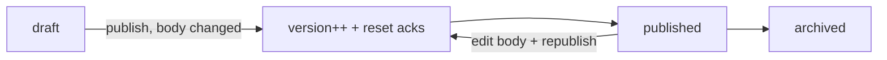

# Policy Library — Architecture

Status is a simple lifecycle `draft → published → archived` (no full state-machine package needed).

## Publish + versioning flow

## Services & Actions

- `PolicyService::publish(...)` — bumps `version` when body changed, resets acknowledgements, notifies audience (all employees or scoped departments).
- `AcknowledgePolicyAction` — actor acknowledges their **own** employee record only; unique per version.
- `PolicyAckReminderCommand` — weekly Mon, queue `notifications`; targets unacknowledged audience only; review-due flagging at `review_date`.

## Jobs & Scheduling

| Job / Command | Queue | Schedule | Idempotency |
|---|---|---|---|
| `PolicyAckReminderCommand` | notifications | weekly Mon | only unacknowledged audience; natural re-remind |

## Filament Artifacts

**Nav group:** Policies

| Artifact | Kind ([[../../../architecture/ui-strategy]] row) | Blueprint / Tweaks | Notes |
|---|---|---|---|
| `PolicyResource` | #1 CRUD resource | tweaks: state-badge-column (draft/published/archived), custom-header-actions (publish modal w/ audience preview + "resets acknowledgements" warning) | Tiptap body (purified); review-due badge |
| `PolicyAcknowledgementPage` | #18 Heat-map / matrix | [[../../../architecture/patterns/page-blueprints#Heat-map / Matrix]] | employees × policies grid, acknowledged/pending cells; CSV export cites `exports` limiter |
| `MyPoliciesPage` | #17 Gallery / directory | [[../../../architecture/patterns/page-blueprints#Gallery / Directory]] — list of policies to read + acknowledge *(assumed)* | self-service; every employee with `legal.policies.acknowledge-own` |

**Access contract (mandatory):** every artifact gates on
`canAccess() = Auth::user()->can('{permission}') && BillingService::hasModule('legal.policies')`
per [[../../../architecture/filament-patterns]] #1. Both custom pages MUST state it explicitly — Filament does not auto-gate them. `MyPoliciesPage` gates on `legal.policies.acknowledge-own` (all employees), not `view-any`.

## Concurrency

| Write path | Tier | Mechanism |
|---|---|---|
| Policy CRUD (draft editing) | Optimistic | `updated_at` stale-check → conflict notification ([[../../../architecture/patterns/optimistic-locking]]) |
| Publish (version bump + ack reset + notify) | Pessimistic | `DB::transaction()` + `lockForUpdate()` on the policy — version bumps once; concurrent publish rejected |
| Acknowledge | n/a | Insert-only, unique `(policy_id, employee_id, version)` — duplicate ack is a constraint no-op |

Tiers per [[../../../decisions/decision-2026-07-02-optimistic-locking-standard]].

## Patterns

- `custom-pages` (acknowledgement matrix + self-service). Body purified via `ezyang/htmlpurifier`; edited with `awcodes/filament-tiptap-editor`.
