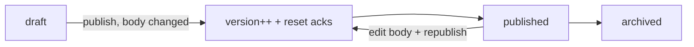

# Policy Library — Architecture

Status is a simple lifecycle `draft → published → archived` (no full state-machine package needed).

## Publish + versioning flow

## Services & Actions

- `PolicyService::publish(...)` — bumps `version` when body changed, resets acknowledgements, notifies audience (all employees or scoped departments).
- `AcknowledgePolicyAction` — actor acknowledges their **own** employee record only; unique per version.
- `PolicyAckReminderCommand` — weekly Mon, queue `notifications`; targets unacknowledged audience only; review-due flagging at `review_date`.

## Jobs & Scheduling

| Job / Command | Queue | Schedule | Idempotency |
|---|---|---|---|
| `PolicyAckReminderCommand` | notifications | weekly Mon | only unacknowledged audience; natural re-remind |

## Patterns

- `custom-pages` (acknowledgement matrix + self-service). Body purified via `ezyang/htmlpurifier`; edited with `awcodes/filament-tiptap-editor`.
