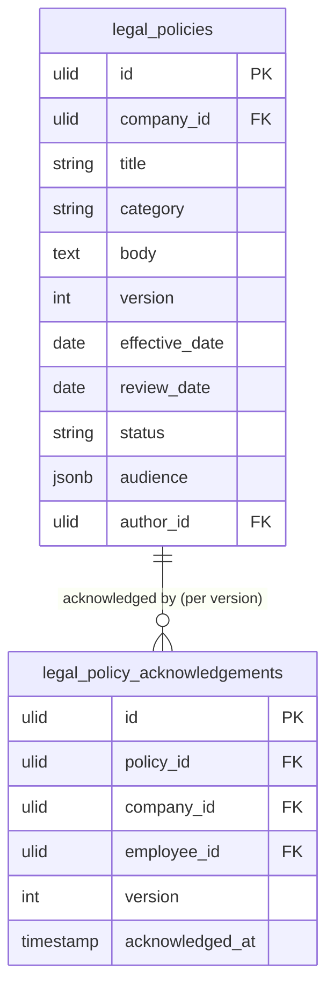

# Policy Library — Data Model

## legal_policies

| Column | Type | Notes |
|---|---|---|
| id, company_id (indexed) | ulid | |
| title / category | string | |
| body | text | purified (htmlpurifier) |
| version | int default 1 | bumps on published body change |
| effective_date / review_date | date | |
| status | string default `draft` | draft / published / archived |
| audience | jsonb nullable | department ids; null = all |
| author_id | ulid FK users | |
| deleted_at | timestamp nullable | |

---

## legal_policy_acknowledgements

| Column | Type | Notes |
|---|---|---|
| id, policy_id FK, company_id (indexed) | ulid | |
| employee_id | ulid FK hr_employees | |
| version | int | ack tied to policy version |
| acknowledged_at | timestamp | |

Unique `(policy_id, employee_id, version)`.

---

## ERD

`employee_id` references `hr_employees` (owned by [[../../hr/employee-profiles/_module|hr.profiles]]) — read-only.
